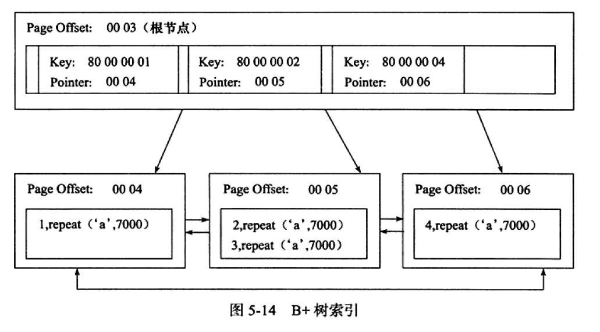
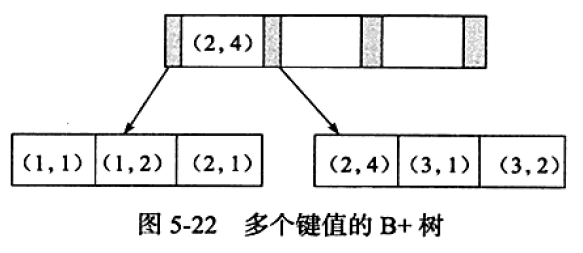

# 数据库-索引

## 1. 索引概念

**索引是一种用于快速查询和检索数据的数据结构。常见的索引结构有: B 树， B+树和 Hash。**

**写在前面：B+树索引并不能找到一个给定键值的具体行，能找到的只是数据行所在的页，然后数据库把页读入内存，再在内存中查找，最后得到数据。**

**优点**：

1. 加快数据的检索速度
2. 唯一索引可以保证表中每行数据的唯一性

**缺点：**

1. 创建索引和维护索引耗费时间（CRUD，索引也需要修改）
2. 索引占用存储空间

### 1.1 主键索引

**主索引：**一个表只有一个主键（不能为null），唯一。InnoDB的表，如果没有显示的指定表的主键，InnoDB会检查有没有唯一索引的字段，有则将其设置为默认主键，否则会自动创建新增的主键。

### 1.2 聚集索引与辅助索引

#### 聚集索引 

InnoDB的表是索引组织表，即表中数据按照主键顺序存放。**聚集索引是按照每张表的主键构造一棵B+树，叶子节点存放的是整张表的行记录数据，所以聚集索引的叶子节点称为数据页**。因为数据页只能按照一棵B+树排序，所以每个表只有一个聚集索引。

**聚集优点：**查询速度快，B+树是平衡树，搜索到叶子结点即定位到数据。快速地进行范围查询。

**聚集缺点：**依赖有序数据。更新代价大：插入更新要调整树，慢。



*上图是B+树聚集索引，非叶子节点是键值和数据页的偏移量，叶子节点上是数据页，是完整的行记录。*

> 以下内容引自《MySQL技术内幕:InnoDB存储引擎》，瞬间明白什么是物理有序。

**聚集索引按照顺序物理地存储数据。**这句话乍一看，就觉得叶子节点的顺序和实际物理存储顺序是相同的。但如果真这样，维护成本非常高。所以，存储并不是物理上的连续，而是逻辑上的连续。该逻辑连续的实现基于：1. 页通过双向链表链接，按主键顺序排序。2. 每个页中的记录通过双向链表维护，则物理存储上可以不按照主键存储。

#### 辅助索引（非聚集）

辅助索引叶节点=键+书签，该书签用来告诉InnoDB哪里可以找到与索引相对应的行数据。由于InnoDB是索引组织表，所以InnoDB辅助索引的书签就是相应行的聚集索引键。InnoDB会通过辅助索引找到主索引的主键，再通过主键索引来找到一个完整的行记录。InnoDB的一个表中可以拥有多个非聚集索引。

**几种辅助索引：**

- **唯一索引：**属性列的值不能重复，但可以为null，可以对多个字段建立唯一索引。

- **普通索引：**加快查询速度，值可以重复可以为null。

- **前缀索引：**字符串前几个字符。

**非聚集优点：**更新代价小。

**非聚集缺点：**依赖有序数据。可能需要二次查询（回表）。

### 1.3 覆盖索引

从辅助索引中就可以得到查询的记录，不需要查询聚集索引中的记录。

- 使用覆盖索引的一个好处是，辅助索引不包含整行记录，而所查询的无需再查聚集索引，减少大量IO。

- 覆盖索引的另一个好处是对统计函数而言的。例如COUNT等，无需通过查询聚集索引进行统计，统计辅助索引，减少IO。

覆盖索引的例子可以参考[mysql覆盖索引与回表](https://www.jianshu.com/p/8991cbca3854)

### 1.4 Hash索引

**优点：**查询快。

**缺点：**

- 只能满足等值查询('='或者'or')，无法满足范围查询
- 无法利用联合索引的部分索引查询
- hash冲突严重时效率不一定高

**总结：**

1. 聚集索引尽量建立在值不会发生变更的列上。
2. 使用聚集索引的查询效率要比非聚集索引的效率要高，但是如果需要频繁去改变聚集索引的值，写入性能并不高，因为需要移动对应数据的物理位置。
3. 非聚集索引在查询的时候可以的话就避免二次查询，这样性能会大幅提升。
4. 不是所有的表都适合建立索引，只有数据量大表才适合建立索引，且建立在选择性高的列上面性能会更好。

### 1.5 Cardinality值

**Cardinality：表示索引中唯一值的数目的估计值。**优化器会根据这个值来判断是否使用这个索引，但这个值不是实时更新的。可以使用`ANALYZE TABLE`命令来更新Cardinality值。

如果每次插入修改都Cardinality值，代价非常大。数据库对Cardinality的统计通过采样完成（默认采样8个叶子节点，省略采样统计过程）。**InnoDB对Cardinality的更新策略为：**

- 表中1/16的数据已发生过变化
- stat_modified_counter > 2000000000（数据变化次数）

### 1.6 联合索引

联合索引有多个索引列，例如：

```
idx_ab (a,b) 
联合a列和b列创建索引
```

**Q：何时需要使用联合索引？**



联合索引的键的数量>=2。假定两个键a，b，联合索引(a,b)，对于语句：

```sql
select ... where a=xxx and b=xxx;
```

显然可以使用联合索引查询，对于单个a列查询（where后面的条件只有a）也可以用联合索引，但对于b列的查询不能使用该B+树索引。

联合索引是对所有列进行排序，例如联合索引(a,b)，先按a排序，a值相同时按b排序。

> 联合索引的第二个好处是已经对第二个键值进行了排序处理。——引自《MySQL技术内幕:InnoDB存储引擎》，书中有详细的栗子。

### 1.7 优化器不使用索引的情况

**这种情况多发生于范围查找，JOIN连接操作等情况。**例如表$$orderdetails$$有$$(OrderID, ProductID)$$的联合主键，还有对于列$$OrderID$$的单个索引。有如下查询语句：

```sql
select * from orderdetails where orderid > 10000 and orderid < 10200
```

实际执行中，优化器选择了全表扫描（PRIMARY聚集索引），而不是OrderID的辅助索引扫描。

因为用户要选取的是整行信息，而使用OrderID索引查询后，还要回表再查聚集索引获取整行信息。这就变成了磁盘的离散操作。但如果要访问的数据量很小（<20%），优化器还是会选择辅助索引，否则使用聚集索引，因为顺序读快于离散读。

当然如果磁盘读写性能好的话，可以加关键字`FORCE INDEX`来强制使用某个索引。

## 2. B树和B+树

**B树和B+树的区别：**

1. B+树内节点不存储数据，所有 data 存储在叶节点导致查询时间复杂度固定为 log n。而B-树查询时间复杂度不固定，与 key 在树中的位置有关。
2. B+树叶节点两两相连可大大增加区间访问性，可使用在范围查询等，而B-树每个节点 key 和 data 在一起，则无法区间查找。
3. B+树更适合外部存储。由于内节点无 data 域，每个节点能索引的范围更大更精确。

## 3. 索引创建规则

### 3.1 何时创建/不创建索引

**何时创建索引**：

1. 表经常进行 SELECT 操作
2. 该字段取值范围很广，几乎没有重复（**高选择性**）
3. 表很大，记录内容分布范围很广
4. 列名经常在 WHERE 子句或连接条件中出现

**何时不创建索引**：

1. 表经常进行 INSERT/UPDATE/DELETE 操作
2. 取值范围很小（例如性别）
3. 表很小
4. 列名不经常作为连接条件或出现在 WHERE 子句中

## 4. 待补充

- 索引的最左匹配原则和原因
- 索引优化


## 参考

《MySQL技术内幕:InnoDB存储引擎》

《深入浅出MySQL：数据库开发、优化与管理维护》