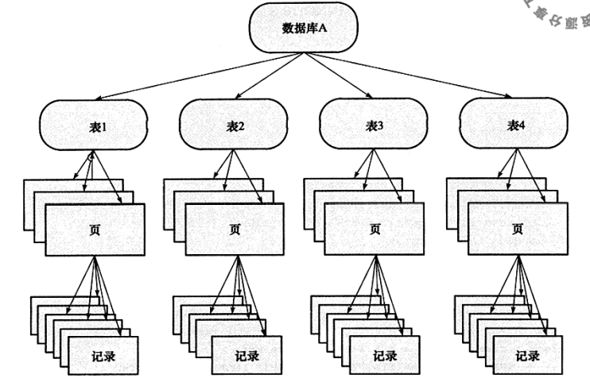
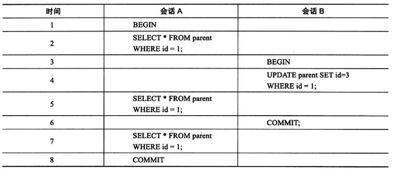
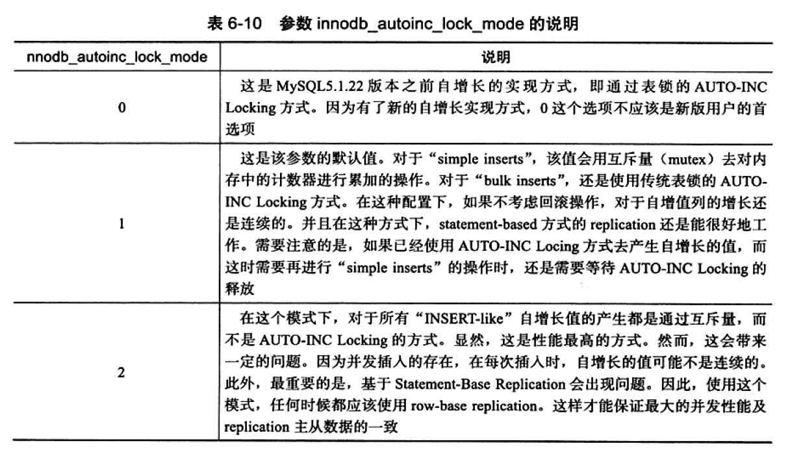

# DB-锁

[TOC]

## 1. 事务的四大特性-ACID

### 1.1 ACID特性如何实现

#### 原子性（A）

**定义：**事务内所有操作为一个整体，要么全做，要么全不做。

**实现原理：**undo log

InnoDB提供了两种事务日志：redo log（重做日志）和undo log（回滚日志）。undo log是逻辑日志，是事务原子性和隔离性实现的基础。

《数据库系统概念》中这样对日志的形式化描述，事务日志记录的几个字段：

- 事务标识：执行write操作事务的唯一标识。
- 数据项标识：所写数据项的唯一标识。
- 旧值：数据项写前值。
- 新值：数据项的写后值。

则一条日志记录可以表示为$<T_i, X_j, V_1, V_2>$，其他日志记录类型：

- $<T_i \quad start>$：事务开始
- $<T_i \quad commit>$：事务提交
- $<T_i \quad abort>$ ：事务中止

#### 一致性（C）

**定义：**事务执行前后，数据库从一个正确的状态转换到另一个正确的状态。**DB的完整性约束没有被破坏。**

实现一致性的措施包括：

- **保证原子性、持久性和隔离性。**如果这些特性无法保证，事务的一致性也无法保证
- **数据库本身提供保障。**例如不允许向整形列插入字符串值、字符串长度不能超过列的限制等
- **应用层面进行保障。**例如如果转账操作只扣除转账者的余额，而没有增加接收者的余额，无论数据库实现的多么完美，也无法保证状态的一致

#### 隔离性（I）

**定义：**并发事务之间相互独立，不互相影响。

InnoDB在RR级别下隔离性：

- 不加锁读：MVCC快照读，可避免脏读，不可重复读，幻读。
- 加锁读：可避免脏读，不可重复读，幻读。

RR虽然避免了幻读问题，但是毕竟不是Serializable，不能保证完全的隔离。

#### 持久性（D）

**定义：**事务提交后，对数据库的改变是持久的。

**保证事务提交后不会因为宕机等原因导致数据丢失，基于redo log。**

> InnoDB作为MySQL的存储引擎，数据是存放在磁盘中的，但如果每次读写数据都需要磁盘IO，效率会很低。为此，InnoDB提供了缓存(Buffer Pool)，Buffer Pool中包含了磁盘中部分数据页的映射，作为访问数据库的缓冲：当从数据库读取数据时，会首先从Buffer Pool中读取，如果Buffer Pool中没有，则从磁盘读取后放入Buffer Pool；当向数据库写入数据时，会首先写入Buffer Pool，Buffer Pool中修改的数据会定期刷新到磁盘中（这一过程称为刷脏）。

Buffer Pool的使用大大提高了读写数据的效率，但是也带了新的问题：如果MySQL宕机，而此时Buffer Pool中修改的数据还没有刷新到磁盘，就会导致数据的丢失，事务的持久性无法保证。

**redo log防止数据丢失：**当数据修改时，先在redo log记录这次操作，再修改Buffer Pool的数据。当事务提交时，会调用fsync对redo log进行刷盘（写入磁盘）。如果MySQL宕机，重启时可以读取redo log中的数据，对数据库进行恢复。

**Q：既然redo log也需要在事务提交时将日志写入磁盘，为什么它比直接将Buffer Pool中修改的数据写入磁盘(即刷脏)要快呢？**主要有以下两方面的原因：

（1）刷脏是随机IO，因为每次修改的数据位置随机，但写redo log是追加操作，属于顺序IO。

（2）刷脏是以数据页（Page）为单位的，MySQL默认页大小是16KB，一个Page上一个小修改都要整页写入；而redo log中只包含真正需要写入的部分，无效IO大大减少。


## 2. 事务隔离级别

### 2.1 并发事务可能造成的问题

- 脏读：A读数据，并修改，还未提交事务。B读数据，此时B读到的是“脏数据”。
- 丢失修改：A读数据，修改，还未提交。B读数据，修改。A提交，B提交。则A的修改丢失了。
- 不可重复读：A读数据，A的事务还没结束，B修改，A在事务内再次读，与第一次读的值不相同。
- 幻读：A读数据，B新增几行数据，A再次读时发现第一次不存在的数据。

不可重复读的重点是修改，幻读的重点在于新增或者删除。

### 2.2 事务隔离级别

**SQL 标准定义了四个隔离级别：**（注意这里是SQL标准，InnoDB在RR级别下使用Next-Key不会导致幻读）

| 隔离级别                       | 脏读 | 不可重复读 | 幻读 |
| :----------------------------- | :--: | :--------: | :--: |
| READ-UNCOMMITTED（读取未提交） |  √   |     √      |  √   |
| READ-COMMITTED（读取已提交）   |  ×   |     √      |  √   |
| REPEATABLE-READ（可重复读）    |  ×   |     ×      |  √   |
| SERIALIZABLE（串行化）         |  ×   |     ×      |  ×   |

隔离级别越低，事务请求的锁越少。**InnoDB 存储引擎默认使用 REPEATABLE-READ（可重读）。**

## 4. InnoDB锁

### 4.1 InnoDB锁类型



**行锁**：

- 共享锁（S）
- 排他锁（X）

**页锁**：

**表锁**：

- 意向共享锁（IS）：事务打算给行**加行共享锁**，加S之前**先取得该表的IS**。
- 意向排他锁（IX）：事务打算给行**加行排他锁**，加X之前**先取得该表的IX**。

> 由于InnoDB支持的是行级别锁，因此意向锁不会阻塞除全表扫描外的任何请求。==？==

InnoDB中锁的兼容性：==？==

|        | **IS** | **IX** | **S** | **X** |
| :----: | :----: | :----: | :---: | :---: |
| **IS** |   √    |   √    |   √   |   ×   |
| **IX** |   √    |   √    |   ×   |   ×   |
| **S**  |   √    |   ×    |   √   |   ×   |
| **X**  |   ×    |   ×    |   ×   |   ×   |


### 4.2 快照读

通过多版本并发控制机制（MVCC），如果要读取的行正在执行delete或update操作（比如别的事务对该数据加了X锁），这时**读取操作不会等待行上的锁释放，会去读取快照数据**。读取快照数据不需要上锁，因为不需要对历史数据进行修改。

InnoDB默认是快照读的方式，但不同事务隔离级别中，对于快照的定义各不相同。

在事务隔离级别`READ COMMITTED(读取已提交)`和`REPEATABLE READ(可重复读)`下，InnoDB采用快照读：

- READ COMMITTED（RC）：快照读总是读取被锁定行的最新一份快照。
- REPEATABLE READ（RR）：快照读总是读取事务开始时的行数据版本。

原因在[深入学习MySQL事务：ACID特性的实现原理](https://www.cnblogs.com/kismetv/p/10331633.html)写的很详细：

> RC与RR一样，都使用了MVCC，其主要区别在于：
>
> RR是在事务开始后第一次执行select前创建ReadView，直到事务提交都不会再创建。RR可以避免脏读、不可重复读和幻读。
>
> RC每次执行select前都会重新建立一个新的ReadView，因此如果事务A第一次select之后，事务B对数据进行了修改并提交，那么事务A第二次select时会重新建立新的ReadView，因此事务B的修改对事务A是可见的。因此RC隔离级别可以避免脏读，但是无法避免不可重复读和幻读。

比如下图，如果A的隔离级别是READ COMMITTED，时间7时的查询结果是空。如果A的隔离级别是REPEATABLE READ，时间7的查询结果和时间2一致。

> 对于READ COMMITTED，从数据库理论角度，其实违反了隔离性。



### 4.3 当前读/锁定读

**锁定读：**读取记录的最新版本，会加锁保证其他并发事务不能修改当前记录，直至事务释放锁。

```sql
select ... for update
select ... lock in share mode
```

第一行SQL语句对行记录加X锁，第二行对记录加S锁。

### 4.4 自增长与锁

自增长是表自动添加的一列属性，是开发中常用的主键方式。InnoDB中，对每个含有自增长值得表都有一个自增长计数器。插入操作，计数器+1，赋值自增长序列，这个方式叫**AUTO-INC Locking**。

该方式的锁是一种特殊的表锁机制，为提高插入性能，锁不是在事务完成后释放，而是在完成插入的SQL语句后立刻释放。AUTO-INC Locking提高了并发插入的效率，但事务仍必须等前一个插入的完成。

MySQL5.1.22版本后，**InnoDB提供轻量级互斥量的自增长实现机制，大大提高了自增长值得插入性能。**配置参数采用不同锁机制：




### 4.4 锁的算法

#### 4.4.1 行锁的3种算法

##### Record Lock

单个行记录上的锁。锁住索引记录。

> 如果InnoDB表在建立的时候没有设置任何索引，InnoDB会使用隐式的主键来进行锁定。==？==

##### Gap Lock

间隙锁，锁定一个范围，但不包含记录本身。Gap Lock的作用是阻止多个事务将记录插入到同一范围内，但这会导致幻象问题。

关闭Gap Lock的显式方法：

- 事务隔离级别设置为READ COMMITTED
- 将参数innodb_locks_unsafe_for_binlog设置为1

##### Next-Key Lock

Gap+Record。锁定一个范围，并锁定记录本身。**InnoDB对于行的查询都采用Next-Key Lock。Next-Key Lock可以解决幻象问题。**

**当查询的索引含有所有唯一索引时，InnoDB会将Next-Key Lock优化降级为Record Lock，提高了应用并发性。若唯一索引由多个列组成，查询仅是多个唯一索引的其中一个，该查询是range查询，不是point查询，依然用Next-Key Lock**

特别注意：对于辅助索引，Next-Key Lock锁定查询条件的范围后，还会对该辅助索引的下一个值加Gap Lock。（书上有很详细的例子）

### 4.5 锁问题

| 锁问题     | 锁问题描述                                                   | 会出现锁问题的隔离级别                            | 解决办法                                                     |
| ---------- | ------------------------------------------------------------ | ------------------------------------------------- | ------------------------------------------------------------ |
| 脏读       | 一个事务中会读到其他并发事务未提交的数据，违反了事务的隔离性； | Read Uncommitted                                  | 提高事务隔离级别至Read Committed及以上；                     |
| 不可重复读 | 一个事务会读到其他并发事务已提交的数据，违反了数据库的一致性要求；可能出现的问题为幻读，幻读是指在同一事务下，连续执行两次同样的SQL语句可能导致不同的结果，第二次的SQL语句可能返回之前不存在的行记录； | Read Uncommitted、Read Committed                  | 默认的RR隔离级别下 ，解决办法分为两种情况：**1、当前读（锁定读）**：Next-Key Lock机制对相关索引记录及索引间隙加锁，防止并发事务修改数据或插入新数据到间隙；**2、版本读：**MVCC，保证事务执行过程中只有第一次读之前提交的修改和自己的修改可见，其他的均不可见；**3. 提高事务隔离级别至Serializable；** |
| 丢失更新   | 并发下两次更新同时进行，后一次更新覆盖了前一次更新的情况，更新丢失是数据没有保证一致性导致的。 | Read Uncommitted、Read Committed、Repeatable Read | 默认的RR隔离级别下 ，解决办法分为两种情况：**1、乐观锁：**数据表增加version字段，读取数据时记录原始version，更新数据时，比对version是否为原始version，如不等，则证明有并发事务已更新过此行数据，**则可回滚事务后重试直至无并发竞争**；**2、悲观锁：**读加排他锁，保证整个事务执行过程中，其他并发事务无法读取相关记录，直至当前事务提交或回滚释放锁； |

#### 4.5.1 幻象问题（幻读）

**幻象问题（幻读）：在同一事务下，连续执行两次同样的SQL可能导致不同的结果，第二次SQL可能会返回之前不存在的行。**

默认事务隔离级别下（可重复读），InnoDB采用Next-Key Locking解决幻像问题。Oracle在串行化级别下才解决幻象问题。

- **为什么RR级别下Next-Key能解决幻读？**

大多数SQL引擎默认是Read-Commited级别（读取已提交）。

幻读：

| 事务A                                                        | 事务B                       |
| ------------------------------------------------------------ | --------------------------- |
| SET SESSION<br />tx_isolation = 'READ-COMMITED';（Record Lock） |                             |
| BEGIN;                                                       |                             |
| SELECT * FROM t where a > 2 FOR UPDATE<br />==返回 a ：5==   |                             |
|                                                              | BEGIN;                      |
|                                                              | ==INSERT INTO t Select 4;== |
|                                                              | COMMIT;                     |
| SELECT * FROM t where a > 2 FOR UPDATE<br />==返回 a : 5, a: 4== |                             |

但如果采用RR级别下的Next-Lock，第一次事务A执行查询语句`SELECT * FROM t where a > 2 FOR UPDATE`，锁住的不仅是5这个值，还对(2, +∞)这个范围加了X锁。在这个范围内别的事务无法插入数据，避免幻读。

### 4.6 乐观锁和悲观锁

**乐观锁：**“乐观地”假定大概率不会发生并发更新冲突，访问、处理数据过程中不加锁，只在更新数据时再根据版本号或时间戳判断是否有冲突，在update的时候再去检查冲突，有则处理（回滚再重复尝试），无则提交事务。

**悲观锁：**“悲观地”假定大概率会发生并发更新冲突，访问、处理数据前就加**排他锁**，在整个数据处理过程中锁定数据，事务提交或回滚后才释放锁；使用`select ... for update`显式的加X锁（行锁）。

**Q：乐观锁和悲观锁的区别：**

乐观锁的思路一般是表中增加版本字段，更新时where语句中增加版本的判断，算是一种CAS（Compare And Swep）操作。

悲观锁一开始就对数据加上锁（SELECT ... FOR UPDATE），然后就可以安心的做判断和更新。

## **5. MVCC机制**

这部分完全参考[深入学习MySQL事务：ACID特性的实现原理](https://www.cnblogs.com/kismetv/p/10331633.html)

MVCC读不加锁，因此读写不冲突，并发性能好。InnoDB实现MVCC，主要基于以下技术及数据结构：

- **隐藏列：**InnoDB中每行数据都有隐藏列，隐藏列中包含了本行数据的事务id、指向undo log的指针等。
- **基于undo log的版本链：**每条undo log也会指向更早版本的undo log，从而形成一条版本链。
- **ReadView：**通过隐藏列和版本链，MySQL可以将数据恢复到指定版本；但是具体要恢复到哪个版本，则需要根据ReadView来确定。事务在某一时刻给整个事务系统（trx_sys）打快照，之后再进行读操作时，会将读到数据中的事务id与trx_sys快照对比，从而判断对该事务（ReadView）是否可见。

InnoDB默认的RR事务隔离级别下，不显式加`lock in share mode`与`for update`的`select`操作都属于快照读，使用MVCC，保证事务执行过程中只有第一次读之前提交的修改和自己的修改可见，其他的均不可见。（不理解）

## 参考

《MySQL技术内幕:InnoDB存储引擎》

[MySQL InnoDB锁机制全面解析分享](https://segmentfault.com/a/1190000014133576)

[深入学习MySQL事务：ACID特性的实现原理](https://www.cnblogs.com/kismetv/p/10331633.html)


