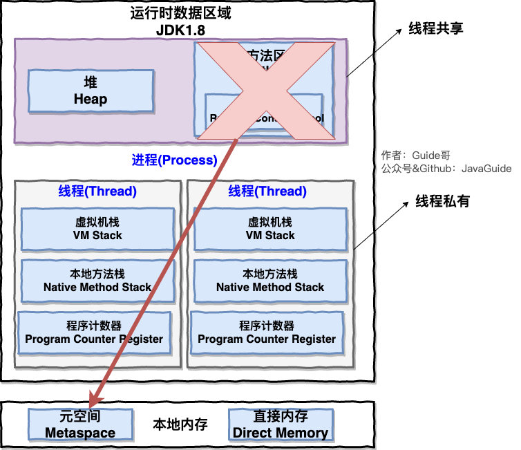

# JVM

## 概览

JVM，Java程序（Java二进制字节码）的运行环境。

好处：跨平台，自动内存管理机制（GC），数组下标越界检查（C需要自己检查），多态。

JVM, JRR, JDK(+javac等编译工具)


常见的jvm：HotSpot，OpenJ9等。

类加载器，JVM内存结构（方法区，堆，虚拟机栈，程序计数器，本地方法栈），执行引擎（解释器，JIT编译器，GC）

## JVM内存结构

线程公有：堆、方法区、直接内存（非运行时数据区的一部分）。

线程私有：计数器，虚拟机栈，本地方法栈。




编译成二进制字节码后是jvm指令（对所有平台一致），再经过解释器将指令解释为一条机器码，CPU才能执行。

### 一、程序计数器PC

记录下一条jvm指令的执行地址，使用寄存器实现。

特点：线程私有的，不会存在内存溢出。

### 二、虚拟机栈 

每线程运行时的内存空间，一个线程一个虚拟机栈。一个栈内由多个栈帧组成（每个方法运行时需要的内存，参数，局部变量，返回地址操作数栈，动态链接等），每个线程只有一个活动栈帧，是指当前正在执行的方法。

***栈的内存是不是越大越好？***不是，栈内存越大，线程数目会变小。

***方法内的局部变量是否线程安全？***如果方法内局部变量没有逃离方法，在栈帧内，不同的线程栈不同，同一个线程对方法的不同调用导致栈帧不同，是线程安全的。如果局部变量引用了对象，逃离了方法（参数，返回值），则不是线程安全的。

栈内存溢出：栈帧过多（递归调用），栈帧过大（少见）。

OOM：虚拟机栈的内存大小可以动态扩展， 如果虚拟机在动态扩展栈时无法申请到足够的内存空间，则抛出`OutOfMemoryError`异常异常。

### 三、本地方法栈

native方法存放的区域。在 HotSpot 虚拟机中和 Java 虚拟机栈合二为一。常见的本地方法：clone()、 wait()、hasCode()、notify()。

### 四、堆

通过new关键字，创建对象都会使用堆内存。是线程共享的，会被GC。

***堆内存溢出：***不断的产生对象，且被使用，不会被GC。

### 五、方法区

**1、定义**

**线程共享**的区域，它用于存储已被虚拟机加载的类信息、常量、静态变量、即时编译器编译后的代码等数据。在JVM启动时创建，逻辑上是堆的一部分，具体实现不同JVM不同。方法区也会导致内存溢出。

HotSpot的JVM的方法区在**JDK1.8之前位于堆内存中，用永久代作为实现方式**。 在**1.8之后**将永久代移除了，方法用**元空间**作为实现方式。

**方法区溢出：**Java1.8之前会导致永久代内存溢出，1.8后会导致元空间内存溢出。


**2、为什么用元空间替代永久代？**

整个永久代有一个 JVM 本身设置固定大小上限，无法进行调整，而**元空间使用的是直接内存，受本机可用内存的限制**，虽然元空间仍旧可能溢出，但是比原来出现的几率会更小。可以使用 `-XX：MaxMetaspaceSize` 标志设置最大元空间大小，默认值为 unlimited，这意味着它只受系统内存的限制。`-XX：MetaspaceSize` 调整标志定义元空间的初始大小。如果未指定此标志，则 Metaspace 将根据运行时的应用程序需求动态地重新调整大小。

**3、运行时常量池和常量池**

**常量池：**是Class文件中的信息，用于存放编译期生成的各种字面量（类名，方法名等）和符号引用。

运行时常量池：运行时常量池是方法区的一部分。当该类被加载到虚拟机之后，这个类的常量池信息就 会放入方法区内存的运行时常量池。

类加载时，加载的是常量池符号到运行时常量池，而执行到相应的jvm指令时才变为字符串对象。

```java
String a = "a"; //运行时，在StringTable中
String d = "d";
String c = a + d; //new StringBuilder().append("a").append("d").toString();在堆上
String f = new String("f");//串池中有一个，堆中有一个。
String e = "a" + "e"; //在StringTable，javac在编译时的优化，结果是确定的
```

**4、字符串常量池StringTable的特性：**

- 常量池中的字符串只是符号，第一次用到时才变为对象。

```java
String a = "a";//运行时才将"a"放入串池
```

- 串池中不存在重复的字符串对象。

```java
String a = "a";//串池中添加a
String b = "a";//b是"a”的新的引用
a == b is true 比较地址
```

- **字符串变量**拼接的原理是StringBuilder

```java
String a = "a";
String b = "b";
String c = a + b;//new StringBuilder().append("a").append("b").toString();
//"a"和"b"在串池中，c在堆上
```

- **字符串常量**拼接的原理是编译优化

```java
String a = "a" + "b"; //结果确定，串池中直接存放"ab"
```

- 可以使用intern方法，主动将串池中还没有的字符串对象放入串池。(1.7后)

```java
String a = "a";
String b = new String("a");
String c = b.intern();
System.out.println(a == c); // true
```

**5、StringTable位置：**

1.6在常量池里和常量池一起在永久代里，1.6永久代在方法去。

1.8StringTable在堆上，但常量池在元空间。永久代内存少，父GC才回收。堆上Minnor GC就触发回收。

**StringTable调优：**

1. 底层是HashTable，如果常量很多，**适当增加桶个数**，减少hash碰撞和查找的消耗。
2. 考虑将字符串入池，去重的思想。

### 六、直接内存

操作系统内存管理。主要用于NIO操作，用于数据缓冲区。分配回收成本较高，但读写性能高。不受JVM内存回收管理。

Java不能直接访问系统缓冲区，先建立Java缓冲区，将系统缓冲区数据读到Java缓冲区，所以数据读了两次。分配直接内存，Java代码和系统都可以直接访问，性能提升。

直接内存的管理通过Unsafe对象完成分配回收，回收需要主动调用freeMemmory方法，不通过Java GC管理。

ByteBuffer的实现类内部，使用了Cleaner（虚引用）来监测ByteBuffer对象，一旦ByteBuffer对象被垃圾回收，那么就会由ReferenceHandler线程（守护线程）通过Cleaner的clean方法调用Unsafe的freeMemory来释放直接内存。

 

### 七、对象的创建

**1、类加载检查**

JVM遇到一条new指令时，首先检查能否在**常量池中定位到类的符号引用**，并检查该符号引用的类是否已被加载过、解析和初始化过。否则，先执行类加载。

**2、分配内存**

对象所需内存大小在类加载完成后可以确定。分配内存的方法有：指针碰撞和空闲列表。

指针碰撞：

没有碎片的情况，空闲位置指针开始，向后分配指定大小的空间返回即可。

空闲列表：

适合堆内存不规整时，JVM维护一个列表，记录哪些块是空闲的，分配时找一块足够大的进行分配。

内存分配如何保证线程安全：

- **CAS+失败重试：** CAS 是乐观锁的一种实现方式。所谓乐观锁就是，每次不加锁而是假设没有冲突而去完成某项操作，如果因为冲突失败就重试，直到成功为止。**虚拟机采用 CAS 配上失败重试的方式保证更新操作的原子性。**
- **TLAB：** 为每一个线程预先在 Eden 区分配一块儿内存，JVM 在给线程中的对象分配内存时，首先在 TLAB 分配，当对象大于 TLAB 中的剩余内存或 TLAB 的内存已用尽时，再采用上述的 CAS 进行内存分配。

**3、初始化零值**

将分配到的内存空间初始化为0（不包括对象头）。

**4、设置对象头**

设置对象头信息，比如哪个类的实例，如何找到类的元信息，对象的hash码，对象的GC分代年龄等信息。

**5、执行init方法**

从JVM的角度，一个对象已经诞生。但从Java程序的角度，还需执行`init`方法，按照代码的逻辑初始化。

### 八、对象的访问定位

**Java通过栈上的引用操作堆上的具体对象**。访问方式由JVM规定，目前主流方式是，句柄和直接指针。

**句柄：**

Java堆中会划分一块内存作为句柄池，引用中存储的是对象的句柄地址，句柄中包含了对象实例数据（堆上）与类型数据（方法区）各自的具体地址信息。

**直接指针：**

引用存储到对象实例的指针，Java堆对象中存储对象实例数据，存储到类型数据（方法区）的指针。

**这两种对象访问方式各有优势。使用句柄来访问的最大好处是 reference 中存储的是稳定的句柄地址，在对象被移动时只会改变句柄中的实例数据指针，而 reference 本身不需要修改。使用直接指针访问方式最大的好处就是速度快，它节省了一次指针定位的时间开销。**

## 垃圾回收

### 一、对象可以回收的条件

1. **引用计数法：计数对象被引用的次数**，当不被引用时可以被回收。A对象中有成员引用B对象，B对象中有成员引用A对象，当指向A对象和B对象的引用置为null时（没有其他对象引用对象A B），导致不能被回收，造成内存泄漏。
2. **可达性分析法：**确定Root对象（肯定不会被GC的对象），遍历所有对象，没有被Root对象直接间接可达的可以被回收，**连通图的思想**。**哪些对象是Root对象？**System Class系统类，Native Stack，Thread活动线程，Busy Monitor正在加锁的对象。
3. **五种引用：**


**强引用：**被GC Root对象直接引用。所有的GC root对象都不通过强引用引用该对象时，该对象才能被垃圾回收。

**软引用：**被GC Root对象间接引用。当只被软引用时，且内存空间不足触发GC了，就会回收软引用对象。

```java
List<SoftReference<byte[]>> list = new ArrayList<>();//List到SoftReference是强引用，SoftReference到byte[]是软引用
RefernenceQueue<byte[]> queue = new ReferenceQueue<>();//引用队列
SoftReference<byte[]> ref = new SoftReference<>(new byte[10], queue);//软引用关联引用队列
```

**弱引用：**被GC Root对象间接引用。比软引用更弱的是，当GC线程扫描到弱引用对象时，不管内存空间是否不足，就回收该对象，它的生命周期更短。

当软引用或弱引用的对象被GC后，引用可以进入引用队列。因为引用也占内存，要找到他们，可以通过引用队列处理。

**虚引用：**必须搭配引用队列一同食用，创建时关联一个引用队列，虚引用并不会决定对象的生命周期。比如虚引用Cleaner引用ByteBuffer，ByteBuffer分配直接内存，并把直接内存的地址返回给cleaner，当ByteBuffer的强引用断开，可以被GC，虚引用cleaner进入引用队列，守护线程会释放直接内存。

**虚引用队列：能找到引用对象，能在对象被GC时收到系统通知。**

**终结器引用：**所有对象都继承Object类，Object有finalize方法，重写终结方法，当没有被强引用时，将终结器引用加入引用队列，由一个优先级很低的线程检查队列，调用finallize方法。所以不推荐finallize方法释放内存。

finalize方法：当对象变成(GC Roots)不可达时，GC会判断该对象是否覆盖了finalize方法，若未覆盖，则直接将其回收。否则，若对象未执行过finalize方法，将其放入F-Queue队列，由一低优先级线程执行该队列中对象的finalize方法。执行finalize方法完毕后，GC会再次判断该对象是否可达，若不可达，则进行回收，否则，对象“复活”。 JVM始终只调用一次，无论这个对象被垃圾回收器标记为什么状态，finalize()始终只调用一次，程序员可以自己调用（最好不要）。

```java
public class GC {
    public static GC SAVE_HOOK =null;
    public static void main(String[] args) throws InterruptedException{
        SAVE_HOOK = new GC();
        SAVE_HOOK = null;
        System.gc();
        Thread.sleep(500);
        if(null!= SAVE_HOOK){
            System.out.println("Yes , I am still alive");
        }else{
         	System.out.println("No , I am dead");
        }
        SAVE_HOOK=null;
        System.gc();
        Thread.sleep(500);
        if(null!=SAVE_HOOK){
            System.out.println("Yes , I am still alive");
        }else{
            System.out.println("No , I am dead");
        }
    }
    @Override
    protected void finalize() throws Throwable {
        super.finalize();
        System.out.println("execute method finalize");
        SAVE_HOOK = this;
    }
}
```

**判断是否回收对象的流程：**

第一次标记，可达性分析算法将对象标记为不可达，再判断是否覆盖了finalize方法，覆盖且未被执行过，则执行finalize方法。不需要执行finalize方法的对象可以被直接回收。

第二次标记，执行finalize方法的对象会被重新标记，检查是否复活。

### 二、垃圾回收算法

#### 标记清除

标记没有被GC root强引用的对象，清除对象占用内存（并不是直接清理内容，这有点多余，而是地址可以提供给别的对象使用，**速度快**），但这种方法**容易产生内存碎片**。

#### 标记整理

标记后，会整理，腾出整块内存，整理**效率慢，但无碎片**。

#### 标记复制

两块相同大小的内存，from和to，to保持空，将from中被强引用的对象复制到to，再清空from，交换from和to，完成了GC，**没有碎片问题，但需要双倍空间**。

### 三、分代垃圾回收

**为什么分为新生代老年代？**

根据对象的存活时间分代管理，针对不同代选择合适的垃圾回收算法，便于GC。**比如在新生代中，每次收集都会有大量对象死去，所以可以选择”标记-复制“算法，只需要付出少量对象的复制成本就可以完成每次垃圾收集。而老年代的对象存活几率是比较高的，而且没有额外的空间对它进行分配担保，所以我们必须选择“标记-清除”或“标记-整理”算法进行垃圾收集。**

新生代：生命周期短，回收频繁。

1. 老年代：生命周期长，存放更有价值的对象，回收频率低。


#### Minor GC

对象新生成在伊甸园，寿命为0，当伊甸园不够分配时，触发Minor GC，将伊甸园和from的可存活对象复制到幸存区To中，寿命+1，回收伊甸园，然后交换幸存区的From和To。Minor GC引发stop the world，暂停其他用户线程，GC完成后，用户线程才能继续。但新生代GC时间很短。

幸存区中寿命超过阈值的对象晋升到老年代。最大寿命15次（4 bit）。

当放入大对象超过伊甸园的大小，直接晋升老年代。

#### Full GC

老年代空间不足，先Minor GC，空间仍不足，触发Full GC，触发stw，时间更长，清理新生代和老年代的全部清理。 Full GC后分配空间仍不足，抛出OOM异常。

**一个线程的OOM不会导致进程的结束。**

### 四、垃圾回收器

#### 串行垃圾回收器

单线程垃圾回收，堆内存较小时，适合单核CPU。**新生代采用标记-复制算法，老年代采用标记-整理算法。**GC时其他用户线程处于阻塞态（STW)。


#### 并行垃圾回收器-吞吐量优先

多线程，适合堆内存较大，多核CPU，**单位时间内STW时间最短**。**吞吐量：GC时间/程序运行时间**，可能单次时间长一点，但次数少，则吞吐量高。**新生代采用标记-复制算法，老年代采用标记-整理算法。**


#### CMS-响应时间优先

CMS(Concurrent Mark Sweep)，多线程，适合堆内存较大，多核CPU，**尽可能让STW单次时间最短**。标记清除算法，会造成碎片问题，造成并发失败，回收器退化成串行。

**初始标记：**设置一个线程进行初始标记，标记GC root强引用的对象，其他用户线程被阻塞（STW）。一般设置1/4 CPU数的初始标记线程，比如4核CPU设置1个线程。

**并发标记：**用户线程和标记线程并发，标记GC Root的可达对象。

**重新标记：**因为在并发标记阶段，用户线程会产生新垃圾，则需要重新标记，标记垃圾，导致STW。这个阶段是并发的，虽然需要从GC Root出发，但前两个阶段减少了该阶段的工作。三色标记法：黑色（已标记，已处理引用关系），灰色（已标记，还有未处理的引用关系），白色（未标记）。重标记完成未完成的白色和灰色对象，剩下的就彻底是白色垃圾了。

**并发清理：**与用户线程并发，清理垃圾，因为其他用户线程在运行，需要分配堆内存，所以清理不能在堆内存剩余较少时才进行，要提早进行。


**CMS的缺点：**

- **碎片问题**，标记清理算法导致。
- **并发清理失败**，并发清理时，用户线程同时并发，可能会造成年轻代满，则触发Minor GC，将存活对象晋升到老年代，但老年代空间也不足，则触发Full GC，不需要整理。
- **晋升失败**，同样是Minor GC时，幸存区晋升到老年代，但老年代的空间碎片化，无法容纳一个晋升对象，则停止用户线程，整理老年代碎片空间，比并发失败更耗时。
- **无法处理浮动垃圾**，即并发清理时行成的垃圾。

#### G1

1.6体验，1.7官方支持，1.9默认，废弃了CMS。**G1 收集器在后台维护了一个优先列表，每次根据允许的收集时间，优先选择回收价值最大的 Region** 。

**特性，优点：**

- **同时注重吞吐量和响应时间。**
- **并发并行：**适合超大堆内存，将堆划分为多个大小相等的区域，每个区域可以独立作为伊甸园，幸存区，老年代。
- **回收算法**：标记整理，两个区域间是复制算法。
- **可预测的停顿**：这是 G1 相对于 CMS 的另一个大优势，降低停顿时间是 G1 和 CMS 共同的关注点，但 G1 除了追求低停顿外，还能建立可预测的停顿时间模型，**能让使用者明确指定在一个长度为 M 毫秒的时间片段内**。

**G1流程：**

**初始标记**：这阶段仅仅只是标记GC Roots能直接关联到的对象并修改TAMS(Next Top at Mark Start)的值，让下一阶段用户程序并发运行时，能在正确的可用的Region中创建新对象，STW但是耗时很短。

**并发标记**：从GC Roots开始对堆的对象进行可达性分析，递归扫描整个堆里的对象图，找出存活的对象，这阶段耗时较长，但是可以与用户程序并发执行。当对象图扫描完成以后，还要重新处理SATB记录下的在并发时有引用变动的对象。

**最终标记**：对用户线程做另一个短暂的暂停，用于处理并发阶段结束后仍遗留下来的最后那少量的 SATB 记录。

**筛选回收**：负责更新 Region 的统计数据，对各个 Region 的回收价值和成本进行排序，根据用户所期望的停顿时间来制定回收计划。


**Young Collection：**

回收新生代。伊甸园->幸存区，幸存区寿命到的去老年，会STW。

**Young Collection + Concurent Mark：**

先新生代回收，标记GC Root，老年代占用比例达到阈值（老年代占堆空间的45%），进行并发标记（不会STW）

**Mixed Collection：**

混合收集，Eden，Survivor，Old都进行回收。最终标记（标记并发标记漏掉的垃圾）会STW，拷贝存活也会STW。由于G1有最大暂停时间，为了在时间内尽可能的GC，对于老年代回收时进行复制，优先收集垃圾最多的区。

**跨代引用：**

新生代GC时，需要找到被GC Root引用的对象，GC Root大概率在老年代，为了快速找到GC Root，使用卡表，将引用新生代的对象设置为脏卡。

新生代通过Remember Set记录外部对自己的引用。

引用变更时，通过写屏障更新脏卡。

**重标记：**

并发标记阶段，用户线程并发，可能修改引用关系，会导致两种变更情况：**一是把原本死亡的对象标记为存活**，本来可达，标记了，引用修改后不可达，成为浮动垃圾，不会被GC。**二是原本存活的对象标记为死亡**，比如原本不可达，修改后可达，但已经遍历过了，不能一直重标记吧，最后就会被当成白色垃圾。

**第一种情况是浮动垃圾，下一次GC可以清除，第二种情况是对象消失，可能会引发程序错误。**

两种方案解决以上问题：

**增量更新（Incremental Update）和原始快照（Snapshot At The Beginning，SATB）**。在HotSpot虚拟机中，**CMS是基于增量更新来做并发标记的，G1则采用的是原始快照的方式。**

都基于写屏障实现，写屏障指令会触发将对象的引用加入到一个队列satb_mark_queue当中重点关注，即在**并发标记处理完后会STW对队列中的所有对象再进行一次重新标记**。增量更新用的是写后屏障(Post-Write Barrier)，记录了所有新增的引用关系。原始快照用的是写前屏障(Pre-Write Barrier)，将所有即将被删除的引用关系的旧引用记录下来。

**字符串去重：**

JDK8u20，String的底层用char[]存放，将所有新分配的字符串放入一个队列，当新生代回收时，G1并发检查是否有字符串重复，如果值一样，引用同一个char[]，与String.intern()不一样，intern关注字符串对象用串池，去重关注char[]。

节省内存，但略微增加新生代回收时CPU占用时间。

**并发标记类卸载：**

JDK8u40，所有对象都经过并发标记后，就能知道哪些类不再被使用，当一个类加载器的所有类都不再使用，则卸载它所加载的所有类。

**回收巨型对象：**

JDK8u60，一个对象大于区域的一半时，称为巨型对象。G1不会对巨型对象进行拷贝。回收时被优先考虑。G1会跟踪巨型对象被老年代的引用（脏卡），当被老年代引用为0时，巨型对象可以在新生代时GC。

**并发标记起始时间的调整：**

JDK9，在Young GC+并发Mark阶段，当老年代占堆的比例达到一定阈值，触发并发标记，可以动态调整这个阈值，使浮动垃圾能容纳下，避免并发GC退化成Full GC。

#### 总结

| 垃圾回收器 | 新生代   | 老年代                                                       |
| ---------- | -------- | ------------------------------------------------------------ |
| 串行       | Minor GC | Full GC                                                      |
| 并行       | Minor GC | Full GC                                                      |
| CMS        | Minor GC | 并发回收失败，才采用Full GC。                                |
| G1         | Minor GC | 回收速度高于产生速度，正常G1回收；回收速度赶不上产生速度，采用Full GC |

### 五、垃圾回收调优

1. 选择合适的 GC 回收器。根据应用对响应时间、吞吐量的要求，合理选用。推荐使用 G1 替换 CMS 垃圾回收器。Java 11 里新引入的 ZGC 垃圾回收器，基本可用做到全阶段并发标记和回收，因此出现 Stop The World 的情况会更少！ 
2. 合理的堆内存大小设置，堆大小不要设置过大，建议不要超过系统内存的 75%，避免出现系统内存 耗尽。响应时间和吞吐量，这两个指标其实是有冲突的。YONG GC占GC的很大一部分，因此新生代的 调整是 GC 调优的核心，新生代过小会导致Young GC 频率高，单位时间内STW的时间就会长吞吐量不 达标，新生代过大，每次Young GC 时间都长，每次STW时间长，导致响应时间不达标，应该根据实际 情况进行折中取一个合理的新生代（大小、伊甸园与幸存区的比例）。 
3. 降低 Full GC 的频率。如果出现了频繁的 Full GC 或者 老年代 GC，很有可能是存在内存泄漏，导致 对象被长期持有。除此之外，新生代和老年代的比例不合适，导致对象频频被直接分配到老年代，也有 可能会造成 Full GC，这个时候需要结合业务代码和内存快照综合分析。

## 类加载

### 一、类文件结构

JVM规范，类文件结构如下：

```java
ClassFile {
    u4             magic; //Class 文件的标志
    u2             minor_version;//Class 的小版本号
    u2             major_version;//Class 的大版本号
    u2             constant_pool_count;//常量池的数量
    cp_info        constant_pool[constant_pool_count-1];//常量池
    u2             access_flags;//Class 的访问标记
    u2             this_class;//当前类
    u2             super_class;//父类
    u2             interfaces_count;//接口
    u2             interfaces[interfaces_count];//一个类可以实现多个接口
    u2             fields_count;//Class 文件的字段属性
    field_info     fields[fields_count];//一个类会可以有多个字段
    u2             methods_count;//Class 文件的方法数量
    method_info    methods[methods_count];//一个类可以有个多个方法
    u2             attributes_count;//此类的属性表中的属性数
    attribute_info attributes[attributes_count];//属性表集合
}
```

**魔数**

0-3字节，表示是否是`.class`类型的文件，不同文件的魔数不一样。

`.class`：ca fe ba be

**版本**

4-7字节，小版本+主版本，表示类的Java版本，比如52（十进制）是Java8。

**常量池**

8-9字节，表示常量池长度，比如 00 23（35）表示常量池有#1~#34项，注意没有#0项。查表。

**访问标识和继承信息**

根据不同位标识是否是：public，final，类，接口，抽象的，注解等等。

**成员变量信息**

数量，type

**Method信息**

方法数量，一个方法由访问修饰符，名称，参数描述，方法属性数量，方法属性组成。

### 二、字节码指令

运行时，常量池加载到运行时常量池，main方法的字节码放到方法区，main线程开始运行，分配相应的栈帧内存，执行引擎取字节码运行，

### 三、编译期处理

### 四、类加载阶段

### 五、类加载器

### 六、运行期优化


