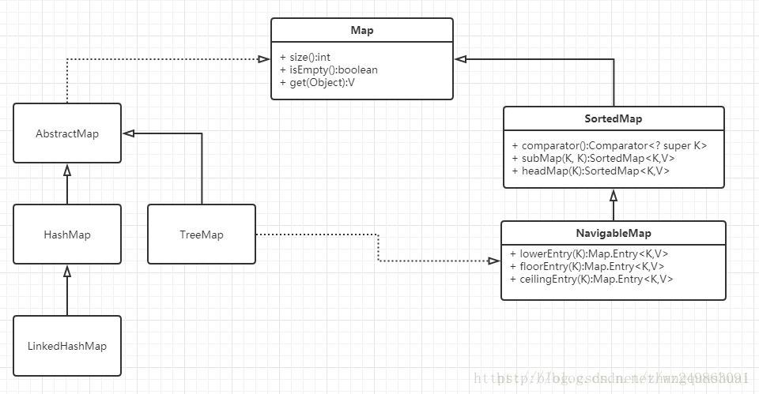

## Java容器

学习**[Java 容器常见面试题/知识点总结](https://snailclimb.gitee.io/javaguide/#/docs/java/collection/Java集合框架常见面试题)** 过程中自己的总结。

下面分为List，Queue，Set，Map四个部分总结。

### List

#### ArrayList和LinkedList的区别

1. **线程安全：** `ArrayList` 和 `LinkedList` 都不保证线程安全。
2. **底层数据结构：** `Arraylist` 底层使用的是 **`Object` 数组**；`LinkedList` 底层使用的是 **双向链表** 数据结构。
3. **插入删除：**`Arraylist` 插入删除受元素位置影响，末尾O(1)，中间`add(int index, E element)`要移动其余元素。`LinkedList`删除O(1)，插入指定位置O(n)。
4. **快速随机访问**：通过元素下标访问， `Arraylist` 支持，`LinkedList`不支持。
5. **内存空间占用**： ArrayList 的空间浪费主要体现在 list 列表的结尾会预留一定的容量空间，而 LinkedList 的空间花费则体现在它的每一个元素都需要消耗比 ArrayList 更多的空间。

#### ArrayList扩容机制

初始大小为10，当添加元素到需要扩容时，容量变为原来的1.5倍。

### Set

- `HashSet`（无序，唯一）: 基于 `HashMap` 实现的，底层采用 `HashMap` 来保存元素。
- `LinkedHashSet`（有序，唯一）：`HashSet` 的子类，并且其内部是通过 `LinkedHashMap` 来实现的。
- `TreeSet`（有序，唯一）： 红黑树(自平衡的排序二叉树)。

#### Comparable和Comparator

- `comparable` 接口实际上是出自`java.lang`包 它有一个 `compareTo(Object obj)`方法用来排序
- `comparator`接口实际上是出自 java.util 包它有一个`compare(Object obj1, Object obj2)`方法用来排序

#### Map

- HashMap
- TreeMap
- HashTable

|                                | HashMap                                                      | Hashtable                                                    |
| ------------------------------ | ------------------------------------------------------------ | ------------------------------------------------------------ |
| 线程安全                       | N                                                            | Y(方法synchronized修饰)                                      |
| 效率                           | 较高                                                         | 较低                                                         |
| 空键和值                       | **null键只能有一个，null值可以多个**                         | 不允许（put 空值的时候会直接抛空指针异常，但是HashMap却做了特殊处理） |
| 初始容量大小和每次扩充容量大小 | 默认16，每次扩容为2倍。给定大小，扩充为2^n大小               | 默认初始大小11，每次扩充变为原来的2n+1                       |
| 底层数据结构                   | **Java8 以后的 `HashMap` 在解决哈希冲突时有了较大的变化，当链表长度大于阈值（默认为 8）（将链表转换成红黑树前会判断，如果当前数组的长度小于 64，那么会选择先进行数组扩容，而不是转换为红黑树）时，将链表转化为红黑树，以减少搜索时间。当红黑树的长度<=6时，退化成链表。** |                                                              |

**相比于`HashMap`来说 `TreeMap` 主要多了对集合中的元素根据键排序的能力以及对集合内元素的搜索的能力。**

#### HashMap

- **散列**

HashMap 通过 key 的 hashCode 经过扰动函数处理过后得到 hash 值，然后通过 `(n - 1) & hash` 判断当前元素存放的位置（这里的 n 指的是数组的长度），如果当前位置存在元素的话，就判断该元素与要存入的元素的 hash 值以及 key 是否相同，**如果key相同的话，直接覆盖**，不相同就通过拉链法解决冲突。

扰动函数指的就是 HashMap 的 hash 方法。使用 hash 方法也就是扰动函数是为了防止一些实现比较差的 hashCode() 方法 换句话说使用扰动函数之后可以减少碰撞。

- **loadFactor 加载因子**

loadFactor 加载因子是控制数组存放数据的疏密程度，loadFactor 越趋近于 1，那么 数组中存放的数据(entry)也就越多，也就越密，也就是会让链表的长度增加，loadFactor 越小，也就是趋近于 0，数组中存放的数据(entry)也就越少，也就越稀疏。

**loadFactor 太大导致查找元素效率低，太小导致数组的利用率低，存放的数据会很分散。loadFactor 的默认值为 0.75f **。

给定的默认容量为 16，负载因子为 0.75。

- **threshold**

**threshold = capacity \* loadFactor**，**当 Size>=threshold**的时候，可能会扩容，扩容需要 rehash、复制数据等操作，所以非常消耗性能。

- **构造方法：**默认构造方法，可以指定容量，指定加载因子
- **put方法：**

补充：

- 直接覆盖之后应该就会 return，不会有后续操作。
- 当链表长度大于阈值（默认为 8）并且 HashMap 数组长度超过 64 的时候才会执行链表转红黑树的操作，否则就只是对数组扩容。

- **resize方法：**

**HashMap常见问题：**

- **table的初始化时机是什么时候，默认初始大小是多少，阈值是多少？**

一般采用默认无参构造方法的话，第一次put时调用resize进行初始化。默认初始容量是16，阈值 = 16 * 0.75 = 12。

- **什么时候触发扩容，扩容之后的 table.length、阀值各是多少？**

当size > 阈值时，进行扩容，扩容后容量大小为原来的2倍，阈值也为2倍，加载因子不变。

- **table 的 length 为什么是 2 的 n 次幂？**

为了利用位运算 & 求 key 的下标，需要利用好 & 运算的特点，当右边的数的低位二进制是连续的 1 ，且左边是一个均匀的数（需要 hash 方法实现，尽量保证 key 的 h 唯一），那么得到的结果就比较完美了。低位二进制连续的 1，我们很容易想到 2^n - 1。

- **求索引的时候为什么是：h&(length-1)，而不是 h&length，更不是 h%length？**

h%length 效率不如位运算快；h&length 会导致 table 的空间得不到利用、降低 table 的操作效率。

- **Map map = new HashMap(1000); 当我们存入多少个元素时会触发map的扩容； Map map1 = new HashMap(10000); 我们存入第 10001个元素时会触发 map1 扩容吗？**

Map map = new HashMap(1000); 当我们存入多少个元素时会触发map的扩容 此时的 table.length = 2^10 = 1024; threshold = 1024 * 0.75 = 768; 所以存入第 769 个元素时进行扩容 Map map1 = new HashMap(10000); 我们存入第 10001个元素时会触发 map1 扩容吗 此时的 table.length = 2^14 = 16384; threshold = 16384 * 0.75 = 12288; 所以存入第 10001 个元素时不会进行扩容。

- **头插还是尾插？**

Java7在多线程操作HashMap时可能引起死循环，原因是扩容转移后前后链表顺序倒置，在转移过程中修改了原来链表中节点的引用关系。如果两个线程同时触发扩容，在移动节点时会导致一个链表中的2个节点相互引用，从而生成环链表。

Java8在同样的前提下并不会引起死循环，原因是扩容转移后前后链表顺序不变，保持之前节点的引用关系。

#### ConcurrentHashMap

**HashTable：**在竞争激烈的并发环境下表现出效率低下的原因，是因为所有访问HashTable的线程都必须竞争同一把锁。

ConcurrentHashMap：那假如容器里有多把锁，每一把锁用于锁容器其中一部分数据，那么当多线程访问容器里不同数据段的数据时，线程间就不会存在锁竞争，从而可以有效的提高并发访问效率。**ConcurrentHashMap首先将数据分成一段一段的存储，然后给每一段数据配一把锁。**

put：

先定位segment，获取segment的锁，如果失败先自旋，自旋达到一定阈值升级为竞争互斥锁。

get：

只需要将 Key 通过 Hash 之后定位到具体的 Segment ，再通过一次 Hash 定位到具体的元素上。

由于 HashEntry 中的 value 属性是用 volatile 关键词修饰的，保证了内存可见性，所以每次获取时都是最新值。

ConcurrentHashMap 的 get 方法是非常高效的，**因为整个过程都不需要加锁**。

有些方法需要跨段，比如size()和containsValue()，它们可能需要锁定整个表而而不仅仅是某个段，这需要按顺序锁定所有段，操作完毕后，又按顺序释放所有段的锁。按序获取锁很重要，可以避免死锁。

- Java1.7：**ReentrantLock+Segment+HashEntry**

一个ConcurrentHashMap实例中包含由若干个Segment实例组成的数组，而一个Segment实例又包含由若干个桶，每个桶中都包含一条由若干个 HashEntry对象链接起来的链表。

- Java1.8：**synchronized+CAS+HashEntry+红黑树**

**Node 数组 + 链表 / 红黑树**

put：

1. 根据 key 计算出 hashcode 。
2. 判断是否需要进行初始化。
3. 即为当前 key 定位出的 Node，如果为空表示当前位置可以写入数据，利用 CAS 尝试写入，失败则自旋保证成功。
4. 如果当前位置的 `hashcode == MOVED == -1`,则需要进行扩容。
5. 如果都不满足，则利用 synchronized 锁写入数据。
6. 如果数量大于 `TREEIFY_THRESHOLD` 则要转换为红黑树。

get：

1. 根据 hash 值计算位置。
2. 查找到指定位置，如果头节点就是要找的，直接返回它的 value.
3. 如果头节点 hash 值小于 0 ，说明正在扩容或者是红黑树，查找之。
4. 如果是链表，遍历查找之。

#### HashMap遍历

[HashMap 的 7 种遍历方式与性能分析！](https://mp.weixin.qq.com/s/Zz6mofCtmYpABDL1ap04ow)

