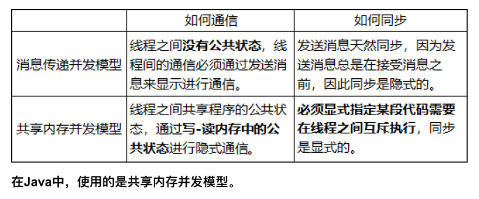
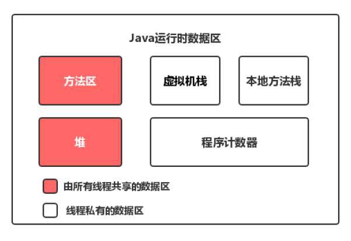
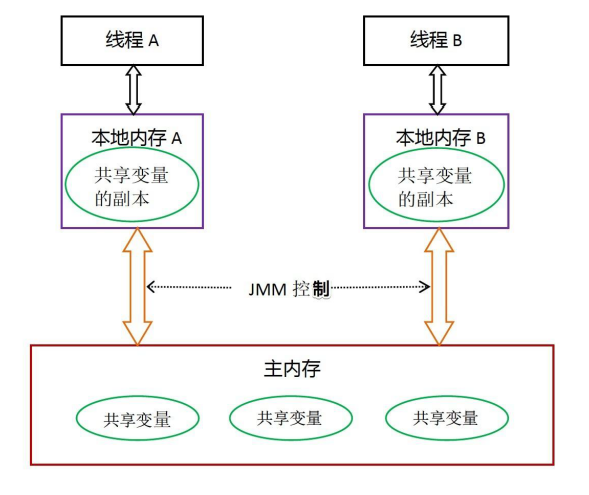

# Java并发基础篇

## 1 进程和线程

进程是程序的一次执行过程，是系统运行程序的基本单位，因此进程是动态的。

一个进程在其执行的过程中可以产生多个线程。与进程不同的是同类的多个线程**共享进程的堆和方法区资源，但每个线程有自己的程序计数器、虚拟机栈和本地方法栈**，所以系统在产生一个线程，或是在各个线程之间作切换工作时，负担要比进程小得多。

**进程让操作系统的并发性成为了可能，而线程让进程的内部并发成为了可能。**

### 1.1 进程和线程的区别

本质的区别是**是否单独占有内存地址空间及其它系统资源（比如I/O）**

- 进程单独占有一定的内存地址空间，所以进程间存在内存隔离，数据是分开的，数据共享复杂但是同步简单，各个进程之间互不干扰；而线程共享所属进程占有的内存地址空间和资源，数据共享简单，但是同步复杂。
- 进程单独占有一定的内存地址空间，一个进程出现问题不会影响其他进程，不影响主程序的稳定性，可靠性高；一个线程崩溃可能影响整个程序的稳定性，可靠性较低。
- 进程单独占有一定的内存地址空间，进程的创建和销毁不仅需要保存寄存器和栈信息，还需要资源的分配回收以及页调度，开销较大；线程只需要保存寄存器和栈信息，开销较小。
- **进程是操作系统进行资源分配的基本单位，而线程是操作系统进行调度的基本单位**，即CPU分配时间的单位。

## 2 Java多线程入门类和接口

实现线程类，两种方式：

- **继承`Thread`类，并重写`run`方法。**在程序里面调用了start()方法后，虚拟机会先为我们创建一个线程，然后等到这个线程第一次得到时间片时再调用run()方法。

- **实现`Runnable`接口的`run`方法。**==可以使用Java8的函数式编程简化代码。==

`Thread`类是一个`Runnable`接口的实现类。

### 2.1 Thread类常用方法

`currentThread()`：静态方法，返回对当前正在执行的线程对象的引用；

`start()`：开始执行线程的方法，Java虚拟机会调用线程内的run()方法；

`yield()`：当前线程愿意让出对当前处理器的占用。需要注意的是，就算当前线程调用了yield()方法，程序在调度的时候，也还有可能继续运行这个线程的；

`sleep()`：静态方法，使当前线程睡眠一段时间；

`join()`：使当前线程等待另一个线程执行完毕之后再继续执行，内部调用的是Object类的wait方法实现的；

### 2.2 继承Thread还是实现Runnable

- 由于Java“单继承，多实现”的特性，Runnable接口使用起来比Thread更灵活。

- Runnable接口出现更符合面向对象，将线程单独进行对象的封装。

- Runnable接口出现，降低了线程对象和线程任务的耦合性。

- 如果使用线程时不需要使用Thread类的诸多方法，显然使用Runnable接口更为轻量。

## 3 Callable、Future与FutureTask

使用`Runnable`和`Thread`来创建一个新的线程，`run`方法是没有返回值的。而有时候我们希望开启一个线程去执行一个任务，并且这个任务执行完成后有一个返回值。

JDK提供了`Callable`接口与`Future`类为我们解决这个问题，这也是所谓的“异步”模型。

### 3.1 Callable接口

==这一部分没有结合实际代码有点难应用，马住。==

`Callable`与`Runnable`类似，同样是只有一个抽象方法的函数式接口。不同的是，`Callable`提供的方法是**有返回值**的，而且支持**泛型**。`Runnable` 接口**不会返回结果或抛出检查异常**。`Callable`一般是配合线程池工具`ExecutorService`来使用的。这里只介绍`ExecutorService`可以使用`submit`方法来让一个`Callable`接口执行。它会返回一个`Future`，我们后续的程序可以通过这个`Future`的`get`方法得到结果。

**Q: 执行 execute()方法和 submit()方法的区别是什么？**

1. **`execute()`方法用于提交不需要返回值的任务，所以无法判断任务是否被线程池执行成功与否；**
2. **`submit()`方法用于提交需要返回值的任务。线程池会返回一个 `Future` 类型的对象，通过这个 `Future` 对象可以判断任务是否执行成功**，并且可以通过 `Future` 的 `get()`方法来获取返回值，`get()`方法会阻塞当前线程直到任务完成， `get（long timeout，TimeUnit unit）`方法则会阻塞当前线程一段时间后立即返回，这时候有可能任务没有执行完。

### 3.2 Future接口

Future是Callable的返回值接口。

```java
public abstract interface Future<V> {
    public abstract boolean cancel(boolean paramBoolean);
    public abstract boolean isCancelled();
    public abstract boolean isDone();
    public abstract V get() throws InterruptedException, ExecutionException;
    public abstract V get(long paramLong, TimeUnit paramTimeUnit)
            throws InterruptedException, ExecutionException, TimeoutException;
}
```

`cancel`方法是试图取消一个线程的执行。

注意是**试图**取消，**并不一定能取消成功**。因为任务可能已完成、已取消、或者一些其它因素不能取消，存在取消失败的可能。`boolean`类型的返回值是“是否取消成功”的意思。参数`paramBoolean`表示是否采用中断的方式取消线程执行。

==实用Tips:==

所以有时候，为了让任务有能够取消的功能，就使用`Callable`来代替`Runnable`。如果为了可取消性而使用 `Future`但又不提供可用的结果，则可以声明 `Future<?>`形式类型、并返回 `null`作为底层任务的结果。

### 3.3 FutureTask类

Future接口的实现类，

```java
// 自定义Callable
class Task implements Callable<Integer>{
    @Override
    public Integer call() throws Exception {
        // 模拟计算需要一秒
        Thread.sleep(1000);
        return 2;
    }
    //1使用Future
    public static void main(String args[]){
        ExecutorService executor = Executors.newCachedThreadPool();
        Task task = new Task();
        Future<Integer> result = executor.submit(task);
        // 注意调用get方法会阻塞当前线程，直到得到结果。
        // 所以实际编码中建议使用可以设置超时时间的重载get方法。
        System.out.println(result.get()); 
    }
    //2使用FutureTask
     public static void main(String args[]) throws Exception {
        ExecutorService executor = Executors.newCachedThreadPool();
        FutureTask<Integer> futureTask = new FutureTask<>(new Task());
        executor.submit(futureTask);
        System.out.println(futureTask.get());
    }
}
```

使用上`2`与`1`有一点小的区别。首先，调用`submit`方法是没有返回值的。这里实际上是调用的`submit(Runnable task)`方法，而`1`，调用的是`submit(Callable<T> task)`方法。

然后，`2`是使用`FutureTask`直接取`get`取值，而`1`是通过`submit`方法返回的`Future`去取值。

**FutureTask的几个状态：**

```java
private volatile int state;
private static final int NEW          = 0;
private static final int COMPLETING   = 1;
private static final int NORMAL       = 2;
private static final int EXCEPTIONAL  = 3;
private static final int CANCELLED    = 4;
private static final int INTERRUPTING = 5;
private static final int INTERRUPTED  = 6;
```

state表示任务的运行状态，初始状态为NEW。运行状态只会在set、setException、cancel方法中终止。COMPLETING、INTERRUPTING是任务完成后的瞬时状态。


## 4 线程组和线程优先级

### 4.1线程组

Java中用ThreadGroup来表示线程组，我们可以使用线程组对线程进行批量控制。每个Thread必然存在于一个ThreadGroup中，Thread不能独立于ThreadGroup存在。

总结来说，线程组是一个树状的结构，每个线程组下面可以有多个线程或者线程组。线程组可以起到统一控制线程的优先级和检查线程的权限的作用。

==什么时候该用线程组，线程组和线程池的区别？==

### 4.2线程优先级

Java中线程优先级可以指定，范围是1~10。不同操作系统支持优先级的划分不同，Java只是给操作系统一个优先级的**参考值**，线程最终**在操作系统的优先级**是多少由操作系统决定。线程的优先级会在线程被调用之前设定。

`getPriority()`和`setPriority()`可获取和设置线程优先级。

如果某个线程优先级无法大于线程所在**线程组的最大优先级**。


## 5 线程状态转换

**操作系统中进程的状态转换**：


- 就绪(ready)：线程正在等待使用CPU，经调度程序调用之后可进入running状态。
- 运行(running)：线程正在使用CPU。
- 等待(waiting): 线程经过等待事件的调用或者正在等待其他资源（如I/O）。

### 5.1 Java线程的6个状态

```java
NEW, RUNNABLE, BLOCKED, WAITING, TIMED_WAITING, TERMINATED;
```


- NEW

尚未启动（未`start()`）。

**关于start()的两个引申问题**（==很好的问题==）

1. 反复调用同一个线程的start()方法是否可行？
2. 假如一个线程执行完毕（此时处于TERMINATED状态），再次调用这个线程的start()方法是否可行？

> 两个问题的答案都是不可行，在调用一次start()之后，threadStatus的值会改变（threadStatus !=0），此时再次调用start()方法会抛出IllegalThreadStateException异常。
>
> 比如，threadStatus为2代表当前线程状态为TERMINATED。

- RUNNABLE

表示当前线程正在运行中。处于RUNNABLE状态的线程在Java虚拟机中运行，也有可能在等待CPU分配资源。

> Java线程的**RUNNABLE**状态其实是包括了传统操作系统线程的**ready**和**running**两个状态的。

- BLOCKED

阻塞状态。处于BLOCKED状态的线程正**等待锁的释放**以进入同步区。

- WAITING

等待状态。处于等待状态的线程变成RUNNABLE状态需要其他线程唤醒。

调用如下3个方法会使线程**进入等待状态**：

1. `Object.wait()`：使当前线程处于等待状态直到另一个线程唤醒它；

2. `Thread.join()`：等待线程执行完毕，底层调用的是Object实例的wait方法；
3. `LockSupport.park()`：除非获得调用许可，否则禁用当前线程进行线程调度。

- TIMED_WAITING

超时等待状态。线程等待一个具体的时间，时间到后会被自动唤醒。

- TERMINATED

终止状态。此时线程已执行完毕。

**线程状态转换图**：

 

### 5.2 线程中断

> 在某些情况下，我们在线程启动后发现并不需要它继续执行下去时，需要中断线程。目前在Java里还没有安全直接的方法来停止线程，但是Java提供了线程中断机制来处理需要中断线程的情况。
>
> 线程中断机制是一种协作机制。需要注意，通过中断操作并不能直接终止一个线程，而是通知需要被中断的线程自行处理。

简单介绍下Thread类里提供的关于线程中断的几个方法：

- Thread.interrupt()：中断线程。这里的中断线程并不会立即停止线程，而是设置线程的中断状态为true（默认是flase）；
- Thread.interrupted()：测试当前线程是否被中断。线程的中断状态受这个方法的影响，意思是调用一次使线程中断状态设置为true，连续调用两次会使得这个线程的中断状态重新转为false；
- Thread.isInterrupted()：测试当前线程是否被中断。与上面方法不同的是调用这个方法并不会影响线程的中断状态。

## 6 Java线程间通信

### 6.1锁与同步

使用对象锁+synchronized锁住代码块。

```java
public class ObjectLock {
    private static Object lock = new Object();

    static class ThreadA implements Runnable {
        @Override
        public void run() {
            synchronized (lock) {
                /**/
            }
        }
    }

    static class ThreadB implements Runnable {
        @Override
        public void run() {
            synchronized (lock) {
                /**/
            }
        }
    }
}
```

### 6.2 等待/通知

锁机制，线程不断地申请锁，会浪费资源。

Java多线程的等待/通知机制是基于`Object`类的`wait()`方法和`notify()`, `notifyAll()`方法实现的。

使用`lock.notify()`叫醒另一个线程，使用`lock.wait()`释放锁。

### 6.3 信号量

JDK提供了一个类似于“信号量”功能的类`Semaphore`。但这里介绍基于`volatile`关键字实现的信号量通信。

**volatile关键字能够保证内存的可见性，如果用volatile关键字声明了一个变量，在一个线程里面改变了这个变量的值，那其它线程是立马可见更改后的值的。**

这里需要注意的是，`volatile`变量需要进行原子操作。

### 6.4 管道

管道是基于“管道流”的通信方式。JDK提供了`PipedWriter`、 `PipedReader`、 `PipedOutputStream`、 `PipedInputStream`。其中，前面两个是基于字符的，后面两个是基于字节流的。

使用管道多半与I/O流相关。当我们一个线程需要先另一个线程发送一个信息（比如字符串）或者文件等等时，就需要使用管道通信了。

### 6.5 join()方法

join()方法是Thread类的一个实例方法。它的作用是让当前线程陷入“等待”状态，等join的这个线程执行完成后，再继续执行当前线程。

有时候，主线程创建并启动了子线程，如果子线程中需要进行大量的耗时运算，如果主线程想等待子线程执行完毕后，获得子线程中的处理完的某个数据，就要用到join方法了。

### 6.6 sleep()方法

**sleep方法是不会释放当前的锁，而wait方法会。**

它们还有这些区别：

- wait可以指定时间，也可以不指定；而sleep必须指定时间。
- wait释放cpu资源，同时释放锁；sleep释放cpu资源，但是不释放锁，所以易死锁。
- wait必须放在同步块或同步方法中，而sleep可以在任意位置。

### 6.7 ThreadLocal类

**1、定义**

一个变量可以被任何线程访问修改，`ThreadLocal`类可以让每个线程绑定自己的，可以将`ThreadLocal`类想成存放数据的盒子，盒子中可以存储每个线程的私有数据。

每个访问ThreadLocal变量的线程都会有这个变量的本地副本，通过`get()`和`set()`来获取和修改副本的值。

**2、ThreadLocal思想**

新建一个ThreadLocal变量，调用set方法后，TL会在该线程new一个ThreadLocalMap，这个存放键值对<TL, value>，Key是该TL。


**3、ThreadLocal内存泄漏问题**

`ThreadLocalMap` 中使用的 key 为 `ThreadLocal` 的弱引用,而 value 是强引用。所以，如果 `ThreadLocal` 没有被外部强引用的情况下，在垃圾回收的时候，key 会被清理掉，而 value 不会被清理掉。这样一来，`ThreadLocalMap` 中就会出现 key 为 null 的 Entry。假如我们不做任何措施的话，value 永远无法被 GC 回收，这个时候就可能会产生内存泄露。ThreadLocalMap 实现中已经考虑了这种情况，在调用 `set()`、`get()`、`remove()` 方法的时候，会清理掉 key 为 null 的记录。使用完 `ThreadLocal`方法后 最好手动调用`remove()`方法

# Java并发原理篇

## 7 Java内存模型

### 7.1 并发编程模型两个关键问题

- **线程间如何通信？**即：线程之间以何种机制来交换信息
- **线程间如何同步？**即：线程以何种机制来控制不同线程间操作发⽣的相对顺序

并发模型解决：



### 7.2 Java内存模型的抽象结构

#### 7.2.1 运行时内存划分

每个线程都有⼀个私有的本地内存，存储了该线程以读、写共享变量的副本。本地内存是Java内存模型的⼀个抽象概念，并不真实存在。它涵盖了缓存、写缓冲区、寄存器等。

**内存可见性，指的是线程之间的可见性，当一个线程修改了共享变量时，另一个线程可以读取到这个修改后的值**。




## 8 重排序，happens-before

### 8.1 重排序

指令重排序：

- 编译器优化重排
  编译器在不改变单线程程序语义的前提下，可以重新安排语句的执行顺序。

- 指令并行重排

  现代处理器采用了指令级并行技术来将多条指令重叠执行。如果不存在数据依赖性(即后⼀个执行的语句无需依赖前面执行的语句的结果)，处理器可以改变语句对应的机器指令的执行顺序。
  
- 内存系统重排

  由于处理器使⽤缓存和读写缓存冲区，这使得加载(load)和存储(store)操作看上去可能是在乱序执，因为三级缓存的存在，导致内存与缓存的数据同步存在时间差。

**指令重排可以保证串⾏语义⼀致，但是没有义务保证多线程间的语义也⼀致。**

### 8.2 happens-before

是一个给程序员使用的规则，只要程序员在写代码的时候遵循happens-before规则，JVM就能保证指令在多线程之间的顺序性符合程序员的预期。

### 8.3 volatile

- 保证变量的**内存可见性**
- 禁止volatile变量与普通变量**重排序**

volatile变量的写和读都是立刻刷新到主存，保证了内存可见性。

JVM如何限制处理器的重排序？通过**内存屏障**（读屏障，写屏障）：

- 阻止屏障两侧的指令重排序；
- 强制把写缓冲区/高速缓存中的脏数据等写回主内存，或者让缓存中相应的数据失效。

### 8.4 synchronized关键字

**Java多线程的锁都是基于对象的**，每一个对象都可以作为一个锁。

“临界区”，指的是某一块代码区域，它同一时刻只能由一个线程执行。

```java
// 关键字在实例方法上，锁为当前实例
public synchronized void instanceLock() {
    // code
}

// 关键字在静态方法上，锁为当前Class对象
public static synchronized void classLock() {
    // code
}

// 关键字在代码块上，锁为括号里面的对象
public void blockLock() {
    Object o = new Object();
    synchronized (o) {
        // code
    }
}
```

在Java 6 及其以后，一个对象其实有四种锁状态，它们级别由低到高依次是：

1. 无锁状态
2. 偏向锁状态
3. 轻量级锁状态
4. 重量级锁状态

| 锁       | 优点                                                         | 缺点                                             | 适用场景                             |
| -------- | ------------------------------------------------------------ | ------------------------------------------------ | ------------------------------------ |
| 偏向锁   | 加锁和解锁不需要额外的消耗，和执行非同步方法比仅存在纳秒级的差距。 | 如果线程间存在锁竞争，会带来额外的锁撤销的消耗。 | 适用于只有一个线程访问同步块场景。   |
| 轻量级锁 | 竞争的线程不会阻塞，提高了程序的响应速度。                   | 如果始终得不到锁竞争的线程使用自旋会消耗CPU。    | 追求响应时间。同步块执行速度非常快。 |
| 重量级锁 | 线程竞争不使用自旋，不会消耗CPU。                            | 线程阻塞，响应时间缓慢。                         | 追求吞吐量。同步块执行时间较长。     |

### 8.5 CAS与原子操作

#### 8.5.1乐观锁与悲观锁

**悲观锁**：

悲观锁就是我们常说的锁。对于悲观锁来说，**它总是认为每次访问共享资源时会发生冲突**，所以必须对每次数据操作加上锁，以保证临界区的程序同一时间只能有一个线程在执行。

**乐观锁：**

乐观锁又称为“无锁”，顾名思义，它是乐观派。**乐观锁总是假设对共享资源的访问没有冲突**，线程可以不停地执行，无需加锁也无需等待。而一旦多个线程发生冲突，乐观锁通常是使用一种称为CAS的技术来保证线程执行的安全性。

**乐观锁多用于“读多写少“的环境，避免频繁加锁影响性能；而悲观锁多用于”写多读少“的环境，避免频繁失败和重试影响性能。**

#### 8.5.2 CAS概念

CAS(Compare And Swap，比较并交换)：

- V：要更新的变量(var)
- E：预期值(expected)
- N：新值(new)

CAS的过程如下：

判断V是否等于E，如果等于，将V的值设置为N；如果不等，说明已经有其它线程更新了V，则当前线程放弃更新，什么都不做。

**CAS是一种原子操作，它是一种系统原语，是一条CPU的原子指令，从CPU层面保证它的原子性。当多个线程同时使用CAS操作一个变量时，只有一个会胜出，并成功更新，其余均会失败，但失败的线程并不会被挂起，仅是被告知失败，并且允许再次尝试，当然也允许失败的线程放弃操作。**

在Java中，如果一个方法是native的，那Java就不负责具体实现它，而是交给底层的JVM使用c或者c++去实现。

`Unsafe`类中有几个`native`的方法是关于CAS，底层是C++写的。

### 8.6 AQS

**AQS**是`AbstractQueuedSynchronizer`的简称，即`抽象队列同步器`，从字面意思上理解:

- 抽象：抽象类，只实现一些主要逻辑，有些方法由子类实现；
- 队列：使用先进先出（FIFO）队列存储数据；
- 同步：实现了同步的功能。

AQS是一个用来**构建锁和同步器的框架**，使用AQS能简单且高效地构造出应用广泛的同步器，比如我们提到的ReentrantLock，Semaphore，ReentrantReadWriteLock，SynchronousQueue，FutureTask等等皆是基于AQS的。

#### 8.6.1 AQS原理

**AQS 核心思想是，如果被请求的共享资源空闲，则将当前请求资源的线程设置为有效的工作线程，并且将共享资源设置为锁定状态。如果被请求的共享资源被占用，那么就需要一套线程阻塞等待以及被唤醒时锁分配的机制，这个机制 AQS 是用 CLH 队列锁实现的，即将暂时获取不到锁的线程加入到队列中。**


AQS 使用一个 int 成员变量（volatile int state）来表示同步状态，通过内置的 FIFO 队列来完成获取资源线程的排队工作。AQS 使用 CAS 对该同步状态进行原子操作实现对其值的修改。

#### 8.6.2 AQS的资源共享方式

资源有两种共享模式，或者说两种同步方式：

**独占模式（Exclusive）：**只有一个线程能执行，如 ReentrantLock。又可分为公平锁和非公平锁，ReentrantLock 同时支持两种锁,下面以 ReentrantLock 对这两种锁的定义做介绍：

- 公平锁：按照线程在队列中的排队顺序，先到者先拿到锁
- 非公平锁：当线程要获取锁时，先通过两次 CAS 操作去抢锁，如果没抢到，当前线程再加入到队列中等待唤醒。

**总结：公平锁和非公平锁只有两处不同：**

1. 非公平锁在调用 lock 后，首先就会调用 CAS 进行一次抢锁，如果这个时候恰巧锁没有被占用，那么直接就获取到锁返回了。
2. 非公平锁在 CAS 失败后，和公平锁一样都会进入到 `tryAcquire `方法，在 `tryAcquire ` 方法中，如果发现锁这个时候被释放了（state == 0），非公平锁会直接 CAS 抢锁，但是公平锁会判断等待队列是否有线程处于等待状态，如果有则不去抢锁，乖乖排到后面。

**源码比较清晰，公平锁调用`acquire`后就进`tryAcquire `，CAS前先判断前面是否有线程在等待。非公平锁调用`acquire`后先第一次CAS，不成功再进`tryAcquire `，没有阻塞队列的判断。**

公平锁和非公平锁就这两点区别，如果这两次 CAS 都不成功，那么后面非公平锁和公平锁是一样的，都要进入到阻塞队列等待唤醒。

相对来说，非公平锁会有更好的性能，因为它的吞吐量比较大。当然，非公平锁让获取锁的时间变得更加不确定，可能会导致在阻塞队列中的线程长期处于饥饿状态。

**共享模式（Share）：**同时可以被多个线程获取，具体的资源个数可以通过参数指定。如Semaphore/CountDownLatch。

#### ReentrantLock和Synchronized对比

1. 两者都是可重入锁
2. ReentrantLock实现依赖Java API，Synchronized基于JVM实现。
3. **ReentrantLock等待可中断** : `ReentrantLock`提供了一种能够中断等待锁的线程的机制，通过 `lock.lockInterruptibly()` 来实现这个机制。也就是说**正在等待的线程可以选择放弃等待，改为处理其他事情**。
4. **ReentrantLock可实现公平锁** : `ReentrantLock`可以指定是公平锁还是非公平锁。而`synchronized`只能是非公平锁。`ReentrantLock`默认情况是非公平的，可以通过 `ReentrantLock`类的`ReentrantLock(boolean fair)`构造方法来制定是否是公平的。
5. **ReentrantLock可实现选择性通知（锁可以绑定多个条件）**: `synchronized`关键字与`wait()`和`notify()`/`notifyAll()`方法相结合可以实现等待/通知机制。`ReentrantLock`类当然也可以实现，但是需要借助于`Condition`接口与`newCondition()`方法。

`Condition`是 JDK1.5 之后才有的，它具有很好的灵活性，比如可以实现多路通知功能也就是在一个`Lock`对象中可以创建多个`Condition`实例（即对象监视器），**线程对象可以注册在指定的`Condition`中，从而可以有选择性的进行线程通知，在调度线程上更加灵活。 在使用`notify()/notifyAll()`方法进行通知时，被通知的线程是由 JVM 选择的，用`ReentrantLock`类结合`Condition`实例可以实现“选择性通知”** ，这个功能非常重要，而且是 Condition 接口默认提供的。而`synchronized`关键字就相当于整个 Lock 对象中只有一个`Condition`实例，所有的线程都注册在它一个身上。如果执行`notifyAll()`方法的话就会通知所有处于等待状态的线程这样会造成很大的效率问题，而`Condition`实例的`signalAll()`方法 只会唤醒注册在该`Condition`实例中的所有等待线程。

#### 8.6.3 AQS底层的模板方法模式

==省略，[详见](https://snailclimb.gitee.io/javaguide/#/docs/java/multi-thread/AQS%E5%8E%9F%E7%90%86%E4%BB%A5%E5%8F%8AAQS%E5%90%8C%E6%AD%A5%E7%BB%84%E4%BB%B6%E6%80%BB%E7%BB%93)==

#### 8.6.4 Semaphore(信号量)

**Semaphore(信号量)可以指定多个线程同时访问某个资源。**

```java
/**
 *
 * @author Snailclimb
 * @date 2018年9月30日
 * @Description: 需要一次性拿一个许可的情况
 */
public class SemaphoreExample1 {
  // 请求的数量
  private static final int threadCount = 550;

  public static void main(String[] args) throws InterruptedException {
    // 创建一个具有固定线程数量的线程池对象（如果这里线程池的线程数量给太少的话你会发现执行的很慢）
    ExecutorService threadPool = Executors.newFixedThreadPool(300);
    // 一次只能允许执行的线程数量。
    final Semaphore semaphore = new Semaphore(20);

    for (int i = 0; i < threadCount; i++) {
      final int threadnum = i;
      threadPool.execute(() -> {// Lambda 表达式的运用
        try {
          semaphore.acquire();// 获取一个许可，所以可运行线程数量为20/1=20
          test(threadnum);
          semaphore.release();// 释放一个许可
        } catch (InterruptedException e) {
          e.printStackTrace();
        }

      });
    }
    threadPool.shutdown();
    System.out.println("finish");
  }

  public static void test(int threadnum) throws InterruptedException {
    Thread.sleep(1000);// 模拟请求的耗时操作
    System.out.println("threadnum:" + threadnum);
    Thread.sleep(1000);// 模拟请求的耗时操作
  }
}

```

demo代码很详细，`acquire`方法会阻塞直到获得许可证， Semaphore 经常用于限制获取某种资源的线程数量。`tryAcquire`不阻塞，获取不到许可证立即返回false。

Semaphore 有两种模式，公平模式和非公平模式，默认非公平。

- **公平模式：** 调用 acquire 的顺序就是获取许可证的顺序，遵循 FIFO；
- **非公平模式：** 抢占式的。

#### 8.6.5 CountDownLatch（倒计时器）

`CountDownLatch` 允许 `count` 个线程阻塞在一个地方，直至所有线程的任务都执行完毕。

是通过一个计数器来实现的，计数器的初始值是线程的数量。每当一个线程执行完毕后，计数器的值就-1，当计数器的值为0时，表示所有线程都执行完毕，然后在`CountDownLatch`上等待的线程就可以恢复工作了。

```java
//调用await()方法的线程会被挂起，它会等待直到count值为0才继续执行
public void await() throws InterruptedException { };   
//和await()类似，只不过等待一定的时间后count值还没变为0的话就会继续执行
public boolean await(long timeout, TimeUnit unit) throws InterruptedException { };  
//将count值减1
public void countDown() { };  //闭锁
```

**典型应用场景**：

- 某一线程在开始运行前等待 n 个线程执行完毕。将 CountDownLatch 的计数器初始化为 n ：`new CountDownLatch(n)`，每当一个任务线程执行完毕，就将计数器减 1 `countdownlatch.countDown()`，当计数器的值变为 0 时，在`CountDownLatch上 await()` 的线程就会被唤醒。一个典型应用场景就是启动一个服务时，主线程需要等待多个组件加载完毕，之后再继续执行。
- 实现多个线程开始执行任务的最大并行性。注意是并行性，不是并发，强调的是多个线程在某一时刻同时开始执行。类似于赛跑，将多个线程放到起点，等待发令枪响，然后同时开跑。做法是初始化一个共享的 `CountDownLatch` 对象，将其计数器初始化为 1 ：`new CountDownLatch(1)`，多个线程在开始执行任务前首先 `coundownlatch.await()`，当主线程调用 countDown() 时，计数器变为 0，多个线程同时被唤醒。

CountDownLatch 是一次性的，计数器的值只能在构造方法中初始化一次，之后没有任何机制再次对其设置值，当 CountDownLatch 使用完毕后，它不能再次被使用。

[demo代码](https://snailclimb.gitee.io/javaguide/#/docs/java/multi-thread/AQS%E5%8E%9F%E7%90%86%E4%BB%A5%E5%8F%8AAQS%E5%90%8C%E6%AD%A5%E7%BB%84%E4%BB%B6%E6%80%BB%E7%BB%93)讲得很好。

#### 8.6.6 CyclicBarrier(循环栅栏)

可循环使用（Cyclic）的屏障（Barrier，让一组线程到达一个屏障（也可以叫同步点）时被阻塞，直到最后一个线程到达屏障时，屏障才会开门，所有被屏障拦截的线程才会继续干活。

和 CountDownLatch 非常类似，它也可以实现线程间的技术等待，但是它的功能比 CountDownLatch 更加复杂和强大。主要应用场景和 CountDownLatch 类似。线程调用 await() 表示自己已经到达栅栏。

> CountDownLatch 的实现是基于 AQS 的，而 CycliBarrier 是基于 ReentrantLock(ReentrantLock 也属于 AQS 同步器)和 Condition 的.

[demo代码](https://snailclimb.gitee.io/javaguide/#/docs/java/multi-thread/AQS%E5%8E%9F%E7%90%86%E4%BB%A5%E5%8F%8AAQS%E5%90%8C%E6%AD%A5%E7%BB%84%E4%BB%B6%E6%80%BB%E7%BB%93?id=_52-cyclicbarrier-%e7%9a%84%e4%bd%bf%e7%94%a8%e7%a4%ba%e4%be%8b)讲的很好，第二个更全面。

#### 8.6.7 CyclicBarrier 和 CountDownLatch 的区别

- CountDownLatch 是计数器，只能使用一次，而 CyclicBarrier 的计数器提供 reset 功能，可以多次使用。
- 对于 CountDownLatch 来说，重点是“一个线程（多个线程）等待”，而其他的 N 个线程在完成“某件事情”之后，可以终止，也可以等待。而对于 CyclicBarrier，重点是多个线程，在任意一个线程没有完成，所有的线程都必须等待。
- CountDownLatch 是计数器，线程完成一个记录一个，只不过计数不是递增而是递减，而 CyclicBarrier 更像是一个阀门，需要所有线程都到达，阀门才能打开，然后继续执行。

# Java并发JDK工具篇

## 9 线程池

**Q: 为什么使用线程池？**

1. 创建/销毁线程需要消耗系统资源，线程池可以**复用已创建的线程**。
2. **控制并发的数量**。并发数量过多，可能会导致资源消耗过多，从而造成服务器崩溃。（主要原因）
3. **可以对线程做统一管理**。

线程池顶层接口是`Executor`接口，`ThreadPoolExecutor`是这个接口的实现类。

### 9.1 ThreadPoolExcutor参数详解

构造函数涉及5~7（重载）个参数：

- **int corePoolSize**：该线程池中**核心线程数最大值**

> 核心线程（正式工）默认会一直存在于线程池中，但非核心线程如果长时间闲置，会被销毁（临时工）。

- **int maximumPoolSize**：该线程池中**线程总数最大值** 。

> =核心线程数+非核心线程数。

- **long keepAliveTime**：**非核心线程闲置超时时长**。

> 非核心线程闲置超时时长。

- **TimeUnit unit**：keepAliveTime的单位。（时间单位）

- **BlockingQueue workQueue**：阻塞队列，维护着**等待执行的Runnable任务对象**。

> 常用的阻塞队列：
>
> **LinkedBlockingQueue**（链表式）；**ArrayBlockingQueue**（数组式，需要指定队列大小）；**SynchronousQueue**（同步队列，内部容量为0，每个put操作必须等待一个take操作，反之亦然。）；**DelayQueue**（延迟队列）

- **ThreadFactory threadFactory**（非必须参数）

> 创建线程的工厂 ，用于批量创建线程，统一在创建线程时设置一些参数，如是否守护线程、线程的优先级等。如果不指定，会新建一个默认的线程工厂。

- **RejectedExecutionHandler handler**（非必须参数）

> **拒绝处理策略**，线程数量大于最大线程数就会采用拒绝处理策略，四种拒绝处理的策略为 ：**AbortPolicy**：**默认拒绝处理策略**，丢弃任务饼抛出异常。**DiscardPolicy**：丢弃新来的任务，但是不抛出异常。**DiscardOldestPolicy**：丢弃队列头部（最旧的）的任务，然后重新尝试执行程序。**CallerRunsPolicy**：由调用线程处理该任务。

### 9.2 ThreadPoolExcutor策略

线程池本身有一个调度线程，这个线程就是用于管理布控整个线程池里的各种任务和事务，例如创建线程、销毁线程、任务队列管理、线程队列管理等等。

故线程池也有自己的状态。`ThreadPoolExecutor`类中定义了一个`volatile int`变量**runState**来表示线程池的状态 ，分别为**RUNNING、SHUTDOWN、STOP、TIDYING 、TERMINATED**。

- 线程池创建后处于**RUNNING**状态。
- 调用shutdown()方法后处于**SHUTDOWN**状态，线程池不能接受新的任务，清除一些空闲worker,会等待阻塞队列的任务完成。
- 调用shutdownNow()方法后处于**STOP**状态，线程池不能接受新的任务，中断所有线程，阻塞队列中没有被执行的任务全部丢弃。此时，poolsize=0,阻塞队列的size也为0。
- 当所有的任务已终止，ctl记录的”任务数量”为0，线程池会变为**TIDYING**状态。接着会执行terminated()函数。

> ThreadPoolExecutor中有一个控制状态的属性叫ctl，它是一个AtomicInteger类型的变量。

- 线程池处在TIDYING状态时，**执行完terminated()方法之后**，就会由 **TIDYING -> TERMINATED**， 线程池被设置为TERMINATED状态。

### 9.3 ThreadPoolExcutor任务处理流程

1. 线程总数量 < corePoolSize，无论线程是否空闲，都会新建一个核心线程执行任务（让核心线程数量快速达到corePoolSize，在核心线程数量 < corePoolSize时）。**注意，这一步需要获得全局锁。**
2. 线程总数量 >= corePoolSize时，新来的线程任务会进入任务队列中等待，然后空闲的核心线程会依次去缓存队列中取任务来执行（体现了**线程复用**）。
3. 当缓存队列满了，说明这个时候任务已经多到爆棚，需要一些“临时工”来执行这些任务了。于是会创建非核心线程去执行这个任务。**注意，这一步需要获得全局锁。**
4. 缓存队列满了， 且总线程数达到了maximumPoolSize，则会采取拒绝策略进行处理。


### 9.4 ThreadPoolExcutor如何做到线程复用？

ThreadPoolExecutor在创建线程时，会将线程封装成**工作线程worker**,并放入**工作线程组**中，然后这个worker反复从阻塞队列中拿任务去执行。

[详见](http://concurrent.redspider.group/article/03/12.html)有很详细的源码解读。

### 9.5 四种常见线程池

如果不想自己写一个线程池，可以使用已经实现的。

1. **CachedThreadPool**

```java
public static ExecutorService newCachedThreadPool() {
    return new ThreadPoolExecutor(0, Integer.MAX_VALUE,
                                  60L, TimeUnit.SECONDS,
                                  new SynchronousQueue<Runnable>());
}
```

可缓存线程池：

- 因为**corePoolSize**为0的关系，不创建核心线程，线程池最大为Integer.MAX_VALUE，线程数无限制。
- 有空闲线程则复用空闲线程，若无空闲线程则新建线程
- 一定程序减少频繁创建/销毁线程，减少系统开销

- 当需要执行很多**短时间**的任务时，CacheThreadPool的线程复用率比较高， 会显著的**提高性能**。而且线程60s后会回收，意味着即使没有任务进来，CacheThreadPool并不会占用很多资源。

2. **FixedThreadPool**

```java
public static ExecutorService newFixedThreadPool(int nThreads) {
        return new ThreadPoolExecutor(nThreads, nThreads,
                                      0L, TimeUnit.MILLISECONDS,
                                      new LinkedBlockingQueue<Runnable>());
}
```

- 核心线程数量和总线程数量相等，只创建核心进程。

- 由于线程不会被回收，会一直卡在阻塞，所以**没有任务的情况下， FixedThreadPool占用资源更多**。

3. **SingleThreadExecutor()**

```java
public static ExecutorService newSingleThreadExecutor() {
    return new FinalizableDelegatedExecutorService
        (new ThreadPoolExecutor(1, 1,
                                0L, TimeUnit.MILLISECONDS,
                                new LinkedBlockingQueue<Runnable>()));
}
```

- 有且仅有一个核心线程
- 使用了LinkedBlockingQueue

4. **ScheduledThreadPool**

创建一个定长线程池，支持定时及周期性任务执行。

```java
public static ScheduledExecutorService newScheduledThreadPool(int corePoolSize) {
    return new ScheduledThreadPoolExecutor(corePoolSize);
}

//ScheduledThreadPoolExecutor():
public ScheduledThreadPoolExecutor(int corePoolSize) {
    super(corePoolSize, Integer.MAX_VALUE,
          DEFAULT_KEEPALIVE_MILLIS, MILLISECONDS,
          new DelayedWorkQueue());
}
```

