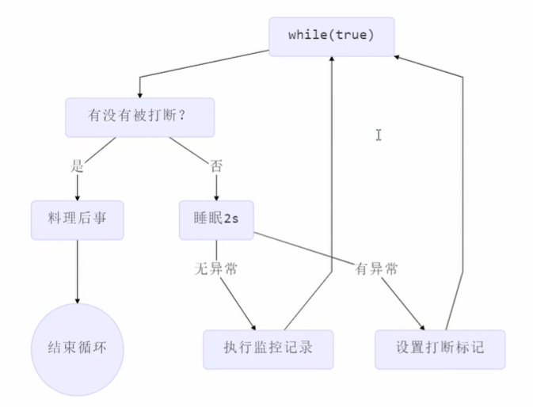
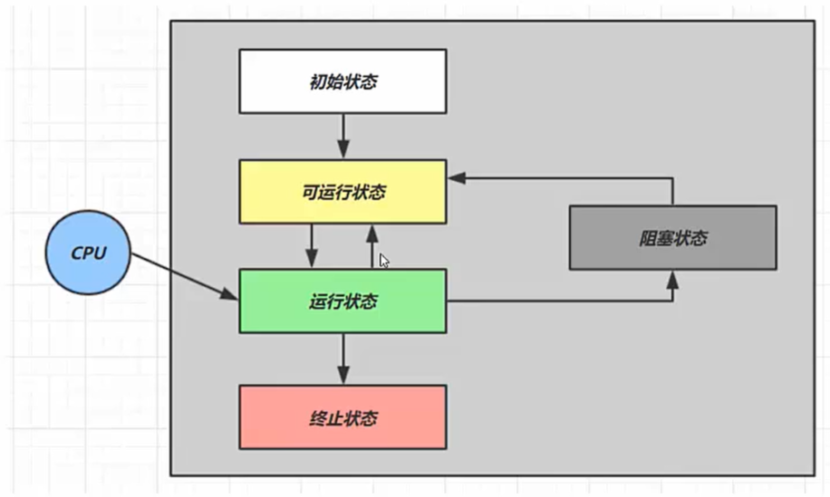

# Java并发编程

[TOC]

## 多线程创建

- **继承Thread类**

继承Thread类，重写`run()`，注意单继承多实现特性，导致该方法不够灵活。线程内的run方法就是任务。

- **实现Runnable接口**

写法：

```java
Runnable runnable = () -> System.out.println("task running...");//lambda, 实现Runnable的run接口

Thread thread = new Thread(runnable, "name");//将任务传入线程
thread.start();
```

将任务和线程分开了，更容易和线程池配合，将任务和线程解耦，更加灵活。

- **实现Callable接口**

`run()`可以抛出异常，有返回值，支持泛型。

写法：

```java
FutureTask<Integer> futureTask = new FutureTask<>(() -> {
            log.debug("running.");
            Thread.sleep(1000);//sleep for 1 sec
            return 1;
});

Thread thread = new Thread(futureTask, "t1");
thread.start();
log.debug(String.valueOf(futureTask.get()));
```

## 线程的常见方法

- **start()**

线程进入就绪状态，不一定立刻运行（等待CPU分配时间片），start()只能调用一次，多次调用会抛出异常。

- **run()**

如果Thread构造函数传入Runnable对象，运行时调用Runnable的run方法，否则执行Thread类的默认run()。

直接调用线程的run方法，而不是start方法，其实执行run的是主线程，并没有new新的线程。

- **join()**

等待线程运行结束，比如main等t1线程结束，在main中调用`t1.join()`。

- **join(long n)**

最多等待n毫秒，超时不会继续等，时间内等待完成即返回。

- **sleep()**

1. 线程从Running进入Time Waiting状态（阻塞态）
2. 其他线程可以用interrupt方法打断正在sleep的线程，sleep方法会抛出异常
3. 睡眠结束后的线程进入###状态，不一定能立刻得到执行
4. TimeUnit的sleep比Thread的sleep可读性更好

- **yeild()**

让出CPU使用权，线程从Running状态进入Runnable状态（就绪态），具体是否让出还取决于OS的任务调度器（比如没有其他线程在等待）

**CPU会把时间片分配给就绪态的线程，但不会分配给阻塞态的线程。**

- **interrupt()**

打断在sleep，join，wait的线程，该线程会抛出异常。中断状态会变成false。

打断正常运行的线程，比如想打断线程t1，主线程执行t1.interrupted()后，是主线程通知t1：我要打断你，但t1并没有立刻被打断，中断状态变为true，t1可以在自己内部根据中断状态判断是否要中断（调用`isInterrupted()`）。

- **isInterrupted()**

判断线程是否被中断，返回true表示线程被中断（根据中断状态）。

- **interrupted()**

判断线程是否被中断，返回true表示线程被中断（根据中断状态），但判断的同时会清除中断状态，比如：

```java
t1.interrupt() //t1的中断状态变为true
t1.interrupted() //返回true，将中断状态清除为false
t1.interrupted() //返回false，将中断状态清除为false
```

**Q：如何正确优雅的终止一个线程？**

错误思路：

1. stop()方法强行杀死线程，如果该线程此时锁住了某些资源，被杀死则没有机会释放锁，别的线程就无法获得锁。
2. System.exit()：整个进程都杀死，过分了。

**两阶段终止模式：**

每次先判断是否被打断，在睡眠时被打断设置打断标记为真。



### 主线程和守护线程

主线程结束，守护线程不管是否执行完，都强制结束。比如GC是守护线程。

设置守护线程：

```
t1.setDaemon(true);
```

### 线程状态



- 可运行状态：就绪态，等待被CPU调度执行
- 运行状态：获取CPU时间片，正在运行
- 阻塞状态：调用了阻塞API，比如读写文件，读写完成后，OS会唤醒阻塞的线程，转换至可运行状态

## 共享模型—管程

临界区：一段代码块，存在多线程对共享资源的读写操作。

竞态条件：多线程在临界区内执行，由于**执行顺序不同导致结果不确定**。

解决临界区的多线程访问问题，可以使用阻塞式（加锁）和非阻塞式（原子变量）。

### Synchronized

**synchronized用对象锁保证了临界区内代码的原子性。**

只有一个线程`A`可以获得锁，进入临界区。其余线程被阻塞，如果进入临界区的线程还没执行完，但CPU分配的时间片用完了，进行上下文切换，但该线程`A`仍持有临界区的锁，之前被阻塞的线程仍然被阻塞（CPU不会为阻塞态的线程分配时间片），直到CPU再为线程`A`分配时间片，`A`执行完任务，才会释放锁，唤醒锁对象上阻塞的线程。