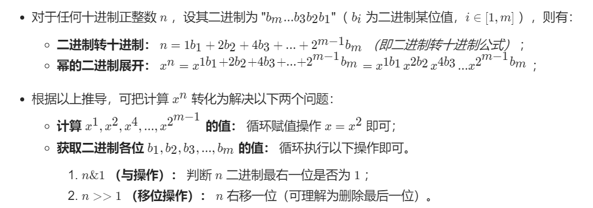

## 剑指 Offer 16.数值的整数次方

#### 题目链接

mid：https://leetcode-cn.com/problems/shu-zhi-de-zheng-shu-ci-fang-lcof/

#### 题目描述

实现函数double Power(double base, int exponent)，求base的exponent次方。不得使用库函数，同时不需要考虑大数问题。

```
输入: 2.00000, 10
输出: 1024.00000

输入: 2.10000, 3
输出: 9.26100

输入: 2.00000, -2
输出: 0.25000
解释: 2-2 = 1/22 = 1/4 = 0.25

-100.0 < x < 100.0
n 是 32 位有符号整数，其数值范围是 [−231, 231 − 1] 。
```

#### 思路

最直接的思路就是乘起来，复杂度是$O(N)$，但某些case会超时，最后变成面向case编程。题解用了**快速幂**的思路，复杂度$O(log2N)$。

从二进制角度解释快速幂：




```java
class Solution {
    public double myPow(double x, int n) {
        if(x == 0) return 0;
        if(n == 0) return 1;
        long b = n;
        if(n < 0){
            x = 1.0/x;
            b = -b;
        }
        double res = 1.0;
        while(b > 0){
            if((b&1) == 1) res *= x;
            x *= x;
            b >>= 1;
        }
        return res;
    }
}
```

- 牛客网的case很简单，简单乘法可以AC。

```java
public class Solution {
    public double Power(double base, int exponent) {
        if(exponent ==0) return 1.0;
        if(base == 0) return 0.0;
        double res = 1.0;
        if(exponent < 0) {
            base = 1.0/base;
            exponent = -exponent;
        }
        for(int i = exponent;i>0;i--){
            res *= base;
        }
        return res;
    }
}
```

