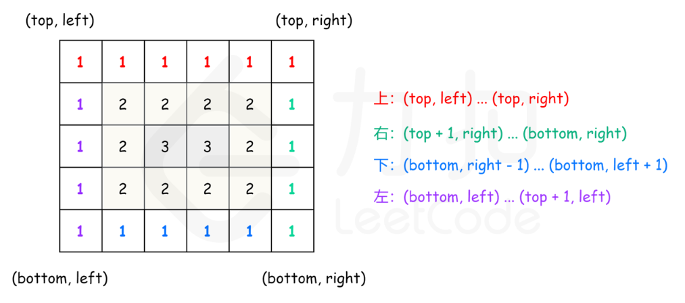

## 剑指 Offer 29.顺时针打印矩阵

#### 题目链接

*easy*: https://leetcode-cn.com/problems/shun-shi-zhen-da-yin-ju-zhen-lcof/ 

同54题相同：https://leetcode-cn.com/problems/spiral-matrix/

本题返回值类型int[], 54题返回list（54更友好）。

#### 题目描述

输入一个矩阵，按照从外向里以顺时针的顺序依次打印出每一个数字。

```
输入：matrix = [[1,2,3],[4,5,6],[7,8,9]]
输出：[1,2,3,6,9,8,7,4,5]

输入：matrix = [[1,2,3,4],[5,6,7,8],[9,10,11,12]]
输出：[1,2,3,4,8,12,11,10,9,5,6,7]

限制：
0 <= matrix.length <= 100
0 <= matrix[i].length <= 100
```

#### 思路

自己做觉得思路有点乱，太久没coding。

- 方法一：按层遍历

对于每层，从左上方开始以顺时针的顺序遍历所有元素。假设当前层的左上角位于 (top, left)，下角位于 (bottom, right)，按照如下顺序遍历当前层的元素。

从左到右遍历上侧元素，依次为 (top, left) 到 (top, right)。

从上到下遍历右侧元素，依次为 (top + 1, right)到 (bottom, right)。

如果 left < right 且 top < bottom，则从右到左遍历下侧元素，依次为 (bottom, right - 1) 到 (bottom, left + 1)，以及从下到上遍历左侧元素，依次为 (bottom, left) 到 (top + 1, left)。

遍历完当前层的元素之后，将 left 和 top 分别增加 1，将 right 和 bottom 分别减少 1，进入下一层继续遍历，直到遍历完所有元素为止。



```java
class Solution {
    public int[] spiralOrder(int[][] matrix) {
        int d = matrix.length-1;
        if(d < 0) return new int[0];
        int r = matrix[0].length-1;
        int size = (r+1)*(d+1);
        int[] res = new int[size];
        int u = 0;
        int l = 0;
        int idx = 0;
        while(idx<size){
            for(int i = l;i<=r;i++,idx++) res[idx] = matrix[u][i];   //向右
            if(++u > d) break;  //重置上边界
            for(int i = u;i<=d;i++,idx++) res[idx] =matrix[i][r];   //向下
            if(--r < l) break; //重置右边界
            for(int i = r;i>=l;i--,idx++)  res[idx] = matrix[d][i];   //向左
            if(--d < u) break;; //重置下边界
            for(int i = d;i>=u;i--,idx++) res[idx] = matrix[i][l];   //向上
            if(++l > r) break;  //重置左边界
        }
        return res;
    }
}
```

- 方法二：模拟

（待填

