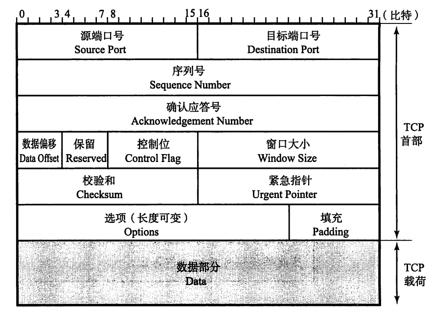
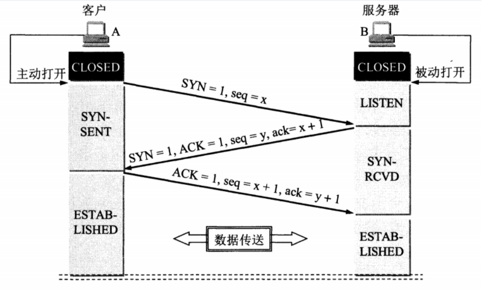
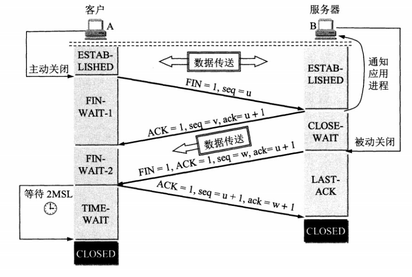

# 传输层

[TOC]

## 1. 概述

传输层是提供**应用进程间的逻辑通信服务**，向应用层屏蔽了下面的网络细节（网络拓扑，路由选择协议等），使应用程序看起来像是在两个传输层实体之间有一条端到端的逻辑通信信道。

## 2. TCP(传输控制协议)

### 2.1 TCP特点

- 面向连接
- 一对一
- 可靠传输
- 全双工
- 面向字节流：应用层传下来的报文看成字节流，把字节流阻止成大小不等的数据块。

### 2.2 TCP报文段格式

- **序列号(seq number)**：**指发送数据的位置。**每发送一次就累加一次数据字节数的大小。序列号是在建立连接时由计算机生成的随机数作为初始值，通过SYN包传给接收端主机。
- **确认号(ack number)**：**下一次应该收到的数据的序列号。**它指已收到`确认号-1`为止的数据。这个序号以前的数据都被正常接收。
- 数据偏移(offset)：数据部分从哪个位开始计算。
- 控制位：从左到右为CWR, ECE, URG, ACK, PSH, SYN, FIN。
  - CWR：与ECE标志都用于IP首部的ECN字段。ECE标志为1时，通知对方已缩小拥塞窗口。
  - ECE：置为1表示网络有拥塞。
  - URG：为1时表示包中有紧急处理的数据。
  - ACK：为1时，确认应答字段变为有效。除了最初建立连接时的SYN包以外，该位必须为1。
  - PSH：为1时，表示将收到的数据立刻上传应用层，否则不需要立刻上传，而是先缓存。
  - RST：为1时，连接出现异常，必须强制端开连接。
  - SYN：用于建立连接，并在seq号字段设定初始值。
  - FIN：为1时，表示不会再有数据，希望断开连接。
- 窗口大小：通知能接收数据大小。
- 校验和

### 2.3 TCP三次握手

1. B处于LISTEN（监听）状态，等待客户端的连接请求。
2. A向B发送连接请求报文(**SYN**)：SYN=1，ACK=0，seq=x（随机指定）。
3. B收到连接请求报文(**SYN-ACK**)：同意连接则向A发送连接确认报文：SYN=1, ACK=1, seq=y（随机指定），ack = x+1。
4. A收到B的连接确认报文后，向B发出确认(**ACK**)：ACK = 1, seq = x+1, ack = y+1。
5. B收到A的确认后，连接建立。

#### Q: TCP为什么3次握手？

可靠传输，需要让双方都分别确认自己的收发与对方的收发是正确可靠的。如下表，Client(S)表示客户端视角看服务器：

- 第一次客户端->服务器，C确认：C发送ok，S确认：S接收ok，C发送ok。
- 第二次服务器->客户端，S确认：S发送ok，C确认：C接收ok，S发送ok，S接收ok。
- 第三次客户端->服务器：S确认：C接收ok。

以上，3次握手让双方都确认自己与对方的发送接收可靠正常，才能建立连接。

|      | Client(C) | Client(C) | Client(S) | Client(S) | Server(C) | Server(C) | Server(S) | Server(S) |
| ---- | --------- | --------- | --------- | --------- | --------- | --------- | --------- | --------- |
|      | send      | receive   | send      | receive   | send      | receive   | send      | receive   |
| 1    | √         |           |           |           | √         |           |           | √         |
| 2    |           | √         | √         | √         |           |           | √         |           |
| 3    |           |           |           |           |           | √         |           |           |

#### Q: 什么是半连接队列？

> 服务器第一次收到客户端的 SYN 之后，就会处于 SYN_RCVD 状态，此时双方还没有完全建立其连接，服务器会把此种状态下请求连接放在一个队列里，我们把这种队列称之为半连接队列。
>
> 当然还有一个全连接队列，就是已经完成三次握手，建立起连接的就会放在全连接队列中。如果队列满了就有可能会出现丢包现象。

#### Q: ISN是什么？是固定的吗？为什么动态随机？

ISN(Initial Sequence Number)指发送方字节数据编号的原点，让对方生成一个合法的接收窗口。

ISN是动态随机的（随时间变化），为了防止在网络中被延迟的分组以后又被传送，而导致接收方解析错误。

动态随机随机导致每个tcp会话里的seq号没有重叠。

#### Q: 三次握手过程中可以携带数据吗？

> 其实第三次握手的时候，是可以携带数据的。但是，**第一次、第二次握手不可以携带数据**。
>
> 为什么这样呢?大家可以想一个问题，假如第一次握手可以携带数据的话，如果有人要恶意攻击服务器，那他每次都在第一次握手中的 SYN 报文中放入大量的数据。因为攻击者根本就不理服务器的接收、发送能力是否正常，然后疯狂着重复发 SYN 报文的话，这会让服务器花费很多时间、内存空间来接收这些报文。
>
> 也就是说，第一次握手不可以放数据，其中一个简单的原因就是会让服务器更加容易受到攻击了。而对于第三次的话，此时客户端已经处于 ESTABLISHED 状态。对于客户端来说，他已经建立起连接了，并且也已经知道服务器的接收、发送能力是正常的了，所以能携带数据也没啥毛病。

### 2.4 TCP四次挥手

- A发送FIN（连接释放报文），seq = u, A处于FIN-WAIT-1状态
- B收到FIN，发送ACK，ack=u+1，seq=v，B处于CLOSE_WAIT状态。**此时TCP处于半关闭状态**，客户端到服务端的连接释放，客户端收到ACK报文后，进入FIN-WAIT-2状态。
- B发送FIN（连接释放报文），seq=w，ack = u+1,  B进入LAST-ACK状态。
- A收到FIN后，发送ACK作为应答，seq = u+1,  ack=w+1，然后A处于TIME-WAIT状态，过一段时间（2MSL）才进入CLOSED状态，B收到ACK后进入CLOSED状态。

#### Q: 为什么需要4次挥手？

> 因为当服务端收到客户端的FIN连接请求报文后，可以直接发送FIN+ACK报文。其中ACK报文是用来应答的，FIN报文是用来同步的。但是关闭连接时，当服务端收到FIN报文时，很可能并不会立即关闭SOCKET，所以只能先回复一个ACK报文，告诉客户端，“你发的FIN报文我收到了”。只有等到我服务端所有的报文都发送完了，我才能发送FIN报文，因此不能一起发送。故需要四次挥手。

#### Q: 四次挥手释放连接时，等待2MSL的意义?

MSL(Maximum Segment Lifetime)：最长报文段寿命，超过这个时间报文将被丢弃。

服务器向客户端发FIN-ACK后进入LAST-ACK状态，如果，如果客户端的ACK丢失，服务器一直接收不到，服务器会超时重传这个FIN-ACK，客户端再重传ACK，重启计时器。如果客户端发完ACK后直接关闭，一旦ACK丢失，服务器就无法正常关闭。

理由：

- 保证客户端最后一个ACK到达服务器端
- 防止“已失效的连接请求报文段”出现在本连接中：

> 客户端在发送完最后一个ACK报文段后，再经过2MSL，就可以使本连接持续的时间内所产生的所有报文段都从网络中消失，使下一个新的连接中不会出现这种旧的连接请求报文段。

### 2.5 TCP流量控制

流量控制：防止发送方发的太快了，来不及接收处理，是一个速度匹配服务。

TCP连接是全双工的，双方各自维护一个接收窗口，接收窗口值放入TCP头部的rwnd字段，通知对方。如果接收端发现缓冲区满了，会将窗口大小设置为0，发送端即停止发送数据，但发送端需要定期发送窗口探测数据段（一个字节），使接收端把窗口大小告诉发送端。

### 2.6 TCP拥塞控制

**拥塞控制：**防止发送方发的太快，网络来不及处理，导致网络链路拥塞。

**丢包事件：**

1. 超时
2. 收到来自接收方的3个冗余ACK。==为什么是3个？==

发送端维护一个拥塞窗口(cwnd)，控制向网络中发送流量的速率。

发送方：未确认的数据量$$<=min{rwnd, cwnd}$$

**TCP拥塞控制算法：**

1. **慢启动：**最初设置cwnd为1，每次收到确认ACK后，将cwnd翻倍，1, 2, 4, 8......。翻倍增长会让cwnd指数级增长，设置阈值ssthresh（初始值16），当rwnd =ssthresh，转为拥塞避免算法。
2. **拥塞避免：**每经过一个RTT，cwnd+1。
3. **快速恢复：**收到3个重复ACK时，cwnd= cwnd/2 + 3(3个重复ACK表示后面有3个报文收到，但未确认，这里提供透支额度)，之后cwnd线性增。

模式切换的情况：

- 当cwnd到达阈值，转为拥塞避免模式。
- 当发生超时事件，将阈值设置为cwnd/2，进入新的慢启动（cwnd为1） Tahoe
- 收到3个重复ACK，

无论是在慢开始阶段还是在拥塞避免阶段，只要丢包事件，就把慢开始门限ssthresh设置为出现拥塞时的发送窗口大小的一半（但不能小于2）。然后把拥塞窗口cwnd重新设置为1，执行慢开始算法。

## 3. UDP(用户数据报协议)

### 3.1 UDP特点

- 无连接
- 尽最大可能交付
- 无拥塞控制
- 面向报文（对应用层的报文不合并不拆分，只添加UDP首部）
- 一对一、一对多、多对一

### 3.2 UDP报文格式

应用场景：

- 包总量少的通信
- 视频、音频多媒体即时通信
- 广播、多播

## 4. GBN和SR

### 4.1 GBN(滑动窗口协议)

**滑动窗口：**如果每发送一个数据段，等一个ACK，再发下一个，串行的话性能较差。**使用滑动窗口，可以一次发多条数据，是服务器端告诉发送端窗口缓冲区的大小（字节）。**

### 4.2 SR(选择重传协议)

## 参考

[面试官，不要再问我三次握手和四次挥手 - 老刘的文章 - 知乎]( https://zhuanlan.zhihu.com/p/86426969)

