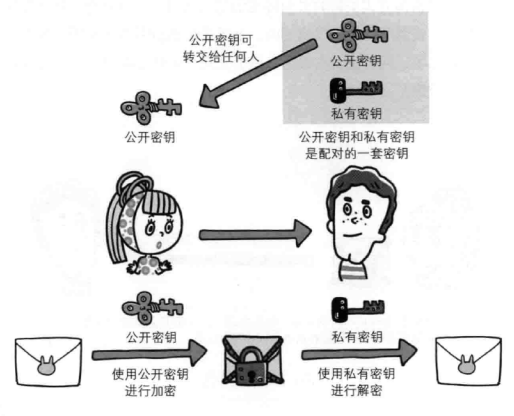

# 应用层

## 1. TCP/IP模型概览

主要总结《图解HTTP》

以TCP/IP协议模型，简要描述请求发出后各层的任务：

客户端在应用层（HTTP协议）发出一个Web页面请求。

传输层（TCP协议）把从应用层接收到的HTTP请求报文进行分割，并在各个报文上打上标记序号、端口号发送给网络层。

网络层（IP协议），增加作为通信目的地的MAC地址后转发给链路层。

接收端逐层拆包，获取HTTP数据。

## 2. URI和URL

- URI(Uniform Resource Identifier) 是统一资源标志符，可以唯一标识一个资源。URI是由某个协议方案表示的资源定位标识符。

- URL(Uniform Resource Location) 是统一资源定位符，可以提供该资源的路径。它是一种具体的 URI，即 URL 可以用来标识一个资源，而且还指明了如何 locate 这个资源。

URI的作用像身份证号一样，URL的作用更像家庭住址一样。URL是一种具体的URI，它不仅唯一标识资源，而且还提供了定位该资源的信息。

知乎这个回答的比喻直击内心：

[HTTP 协议中 URI 和 URL 有什么区别？ - denight的回答 - 知乎]( https://www.zhihu.com/question/21950864/answer/154309494)

## 3. HTTP协议

### 3.1 HTTP协议报文

**HTTP请求报文格式（头部和主体间是CR+LF空行）：**

**HTTP响应报文格式（头部和主体间是CR+LF空行）：**

#### 3.1.1 HTTP编码

- **内容编码提升传输速率**

HTTP在传输数据时可以按照数据原貌直接传输，也可以在传输过程中通过编码提升传输速率。

内容编码指应用在实体上的编码格式，保持实体信息原样压缩，客户端接收需解码。

常用内容编码：`gzip`，`compress`，`deflate`，`identity`

- **分块传输编码**

HTTP通信中，实体资源未全部传输完成之前，浏览器无法显示请求界面。在传输大容量数据时，将页面数据分割成多块，让浏览器逐步显示页面。这种方式叫**分块传输编码**。

### 3.2 GET和POST的区别

截取了[GET 和 POST 到底有什么区别？ - 大宽宽的回答 - 知乎]( https://www.zhihu.com/question/28586791/answer/767316172)的小部分内容。以下只讨论浏览器的GET和POST。

- **GET**

**GET用于读取一个资源**，比如GET一个html文件，**反复读取不应该对访问的数据有副作用**。比如”GET一下，用户就下单了，返回订单已受理“，这是不可接受的。**没有副作用被称为”幂等“**。GET是读取，请求的数据可以缓存，比如缓存到浏览器本身等方式。

- **POST**

**POST来提交一个表单，并得到一个结果的网页。**比如，点击按钮提交时会发出POST请求，POST是不幂等的，是有副作用的。有副作用意味着不能随意多次执行，不能缓存，比如POST一个订单，服务器创建新订单（所谓副作用），然后返回订单成功的界面，这个页面不能被缓存。试想一下，如果POST请求被浏览器缓存了，那么下单请求就可以不向服务器发请求，而直接返回本地缓存的“下单成功界面”，却又没有真的在服务器下单。

**GET和POST携带数据的格式也有区别：**

**GET：**当浏览器发出一个GET请求时，就意味着要么是用户自己在浏览器的地址栏输入，要不就是点击了html里a标签的href中的url。

**POST：**浏览器的POST请求都来自表单提交。每次提交，表单的数据被浏览器用编码到HTTP请求的body里。

**综上，简单地说GET和POST的区别（浏览器）：**

- 目的不同：GET用于读取，POST用于提交。
- 副作用和缓存：GET无副作用，结果可以缓存。POST有副作用，结果不能缓存。
- body：GET没有body，请求数据放在url的querystring里。POST请求数据放在body里。

### 3.3  Cookie

HTTP是无状态协议，不对之前发生过的请求和响应进行记录。比如在主页面登录认证了，跳到新页面时又需要身份信息，是不是又要再次登录？

Cookie的引用解决了这个问题。第一次Server会在响应报文内通过Set-Cookie字段通知客户端保存Cookie，下次客户端再发送请求时，会在请求报文中加入Cookie。

#### 3.3.1 Cookie和Session的区别

引自[COOKIE和SESSION有什么区别？ - 轩辕志远的回答 - 知乎]( https://www.zhihu.com/question/19786827/answer/28752144)

> 1. 由于HTTP协议是无状态的协议，所以服务端需要记录用户的状态时，就需要用某种机制来识具体的用户，这个机制就是Session.典型的场景比如购物车，当你点击下单按钮时，由于HTTP协议无状态，所以并不知道是哪个用户操作的，所以服务端要为特定的用户创建了特定的Session，用用于标识这个用户，并且跟踪用户，这样才知道购物车里面有几本书。这个Session是保存在服务端的，有一个唯一标识。在服务端保存Session的方法很多，内存、数据库、文件都有。集群的时候也要考虑Session的转移，在大型的网站，一般会有专门的Session服务器集群，用来保存用户会话，这个时候 Session 信息都是放在内存的，使用一些缓存服务比如Memcached之类的来放 Session。
>
> 2. 思考一下服务端如何识别特定的客户？这个时候Cookie就登场了。每次HTTP请求的时候，客户端都会发送相应的Cookie信息到服务端。实际上大多数的应用都是用 Cookie 来实现Session跟踪的，第一次创建Session的时候，服务端会在HTTP协议中告诉客户端，需要在 Cookie 里面记录一个Session ID，以后每次请求把这个会话ID发送到服务器，我就知道你是谁了。有人问，如果客户端的浏览器禁用了 Cookie 怎么办？一般这种情况下，会使用一种叫做URL重写的技术来进行会话跟踪，即每次HTTP交互，URL后面都会被附加上一个诸如 sid=xxxxx 这样的参数，服务端据此来识别用户。
>
> 3.  Cookie其实还可以用在一些方便用户的场景下，设想你某次登陆过一个网站，下次登录的时候不想再次输入账号了，怎么办？这个信息可以写到Cookie里面，访问网站的时候，网站页面的脚本可以读取这个信息，就自动帮你把用户名给填了，能够方便一下用户。这也是Cookie名称的由来，给用户的一点甜头。
>
>    所以，总结一下：
>    Session是在服务端保存的一个数据结构，用来跟踪用户的状态，这个数据可以保存在集群、数据库、文件中；
>    Cookie是客户端保存用户信息的一种机制，用来记录用户的一些信息，也是实现Session的一种方式。

### 3.4 HTTP1.0, 1.1, 2.0

- 1.0：

  默认短连接（一次HTTP请求建立一次TCP连接），如果要打开长连接需要设置Connection:Keep-Alive，默认为Connection:close。

- 1.1：

  - 默认长连接
  - 支持流水线（同一条长连接上连续发出请求，不用等待响应返回）

- 2.0（未掌握）：
  - 二进制分帧层
    - 头帧和数据帧
    - 来自不同数据流的帧可以交替发送，然后根据帧头的数据流标识符重新组装
    - 一个TCP连接可以承载任意数量的数据流，即多路复用，一次TCP连接处理多个请求
  - 服务端推送
    - 客户端一次请求，服务端主动推送所有相关资源
  - 报文头压缩
    - 客户端和服务端同时维护和更新一个之前见过的首部字段表，不会重复传输在表中的字段

### 3.5 HTTPS

#### 3.5.1 HTTP问题

HTTP安全问题：

- 通信使用明文，内容可能会被窃听
- 不验证通信方身份，可能遭遇伪装
- 无法证明报文的完整性，可能遭受恶意篡改

#### 3.5.2 HTTPS对比HTTP

##### 加密

HTTPS：HTTP通信接口部分采用SSL/TLS替代。HTTP直接和TCP通信，使用SSL后，先和SSL通信，SSL和TCP通信。

- **对称加密：**

加密和解密用同一个密钥。如果攻击者也拿到密钥，即可破解。发送密钥有风险。

- **非对称加密（SSL采用非对称加密的方式）：**

发送密文一方（A）方使用对方的公开密钥加密，接收的一方（B）使用自己的私有密钥解密。公开密钥可以随意发布，私有密钥不可以。

**HTTPS采用混合加密机制（对称+非对称）：**

1. 使用非对称加密安全地交换在对称加密中使用的密钥。
2. 确保交换密钥安全的前提下，使用对称加密进行通信。

非对称更安全，但处理更复杂，效率比对称低，这样就能理解混合加密的原因了。

##### 认证

非对称加密仍存在问题：无法认证密钥本身是货真价实的。解决方案：使用由数字证书认证机构（CA）颁发的密钥证书。

*HTTPS的通信步骤在《图解HTTP》中讲的很详细。*

## 参考

《图解HTTP》

《计算机网络：自顶向下方法》