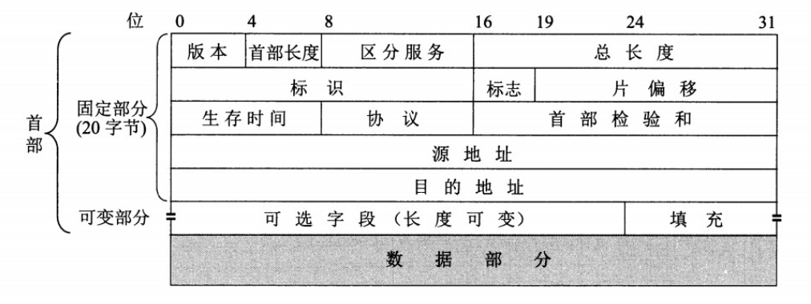

# 网络层

[TOC]

## 1. 概述

网络层中的分组被称为**数据报**，

网络层的连接服务：虚电路网络

网络层的非连接服务：数据报网络

网络层的协议分为三个部分：

- IP协议
- 路由选择协议：决定数据报从源到目的的路径
- 差错和信息报告协议：ICMP

## 2. IP协议

### 2.1 IP数据报格式

- 版本号：IP协议版本，IPv4/IPv6
- 服务类型：可以区分实时数据报（低时延，高吞吐等）和非实时数据报
- 标识
- 标志
- 片偏移
- 生存时间（TTL）：每经过一台路由器，TTL-1，当TTL为0，丢弃该数据报
- 协议：指定上交的运输层协议（eg. TCP/UDP）
- 首部校验和：检验数据报的比特错误，注意每台路由器都会计算

### 2.2 IP数据分片

1. **为什么分片？**

IP数据报要向下交给链路层，首先链路层对数据报长度有限制，其次每段链路上可能使用不同的协议。

2. **如何分片：**

IP协议是不可靠的，所以考虑两个问题，一是如何判断何时接收到数据报的最后一个分片，二是怎么将片恢复为数据报。对于第一个问题，最后一个分片的标志位为0。对第二个问题，标识号(id)相同的为同一数据报，设置偏移标识片的相对位置，用于恢复，偏移值和数据载荷都是8字节的倍数。

3. **分片的缺点：**

额外开销，使网络层在路由器和端系统的实现变得复杂，容易受DoS攻击。（IPv6不采用分片）

## 3. ARP协议

## 4. ICMP协议

## 5. CIDR

无分类域间路由选择（CIDR） 是解决目前 IP 地址紧缺的一个好办法。

CIDR 记法（a.b.c.d/x）把 IP 地址后面加上斜线“/”，然后写上前缀所所占的位数。前缀用来指明网络，前缀后面的部分是后缀，用来指明主机。CIDR 把前缀都相同的连续的 IP 地址组成一个“CIDR 地址块”，IP 地址分配都以 CIDR 地址块为单位。

1. **获取一块子网地址**

想获取一块CIDR地址块用于组织子网，可向上层ISP申请。

2. **为主机分配IP地址（DHCP）**

DHCP: 动态主机配置协议，允许一台主机自动获取一个IP地址，“即插即用”协议，DHCP动态更新自己的IP地址表。

3. **网络地址转换（NAT）**

可用于解决IPv4地址短缺问题，如果单用CIDR地址，最终每台接入因特网的主机其实都占用一个IP，CIDR只是解决了可见性和方便路由的问题。NAT的思路是，为路由器添加地址转换表，假设每个家庭里的路由器子网地址都是10.0.0.0/24，可以有很多个这样的子网地址，但当子网内向外请求服务器资源时，路由器根据地址转换表改写目的ip和端口号，接收外面发进子网的报文也同理。NAT像加在路由器上的代理。

《自顶向下》中提到了几个反对NAT的观点，比如从概念上（这块理解还不到位），还有NAT妨碍P2P程序。

